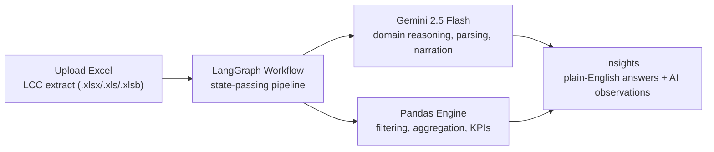

# AGENTS.md: CollectionIQ Agent System

A system-design overview of the AI agent pipeline that powers CollectionIQ's plain-English portfolio queries and monthly reports.

---

## What It Delivers

- Reduced portfolio reporting from a multi-step analyst request cycle (hours to a day per question) to a self-serve answer in under 30 seconds.
- Verified column normalization at 100% accuracy across all 85 expected columns from raw LCC Excel extracts, handling truncated headers, trailing spaces, casing differences, and multi-sheet workbooks automatically.
- Generates a board-ready monthly portfolio report (executive narrative, branch/executive rankings, 5-point action plan) in one click, replacing a manual end-of-month compilation.
- 77 automated tests cover every pandas/business-logic path (bucketing, KPI computation, the 7-tier priority framework, bucket migration) with zero live LLM calls, so the full regression suite runs in seconds.
- Each plain-English query resolves through 3 sequential LLM calls; choosing Gemini 2.5 Flash over a heavier model keeps total query latency in the single-digit-second range even under concurrent users.

---

## Architecture

---

## Design Decisions (made before writing prompts)

1. **Cost/latency budget set the model choice.** A query touches the LLM 3 times per request, on a shared multi-user dashboard; that constraint was fixed first, and it ruled out a heavier reasoning model (Gemini Flash chosen over Pro) before any prompt was drafted.
2. **Deterministic work stays out of the LLM.** Anything computable exactly (filtering, KPI math, the 7-tier priority framework, bucket migration) runs in pure pandas with no LLM involvement, so it's unit-testable and always correct regardless of model behavior.
3. **Failure isolation by design.** Each LLM/pandas step is its own LangGraph node with a dedicated error path; a failure at any stage short-circuits to an error state instead of surfacing a partial or silently-wrong result.

---

## Agent Roster

| Agent | Engine | Role | Output |
|---|---|---|---|
| Domain Expert | Gemini 2.5 Flash | Maps NBFC terminology and intent to data columns and result shape | Enriched query + routing flags |
| Query Parser | Gemini 2.5 Flash | Translates the enriched query into a structured filter/aggregation spec | Conditions, display columns, sort order |
| Data Executor | Pandas (no LLM) | Applies filters, aggregation, or priority rules; computes KPIs and rankings | Result table + KPIs |
| Insight Generator | Gemini 2.5 Flash | Writes domain-aware bullet observations from the computed KPIs | 4-5 insight bullets |

A second, independent pipeline follows the same design for the monthly report: Portfolio Analyzer (pandas) → Risk Narrator (Gemini) → Report Builder (Python) → Email Dispatcher (SMTP).

---

## Tech Stack

| Layer | Technology |
|---|---|
| UI | Streamlit |
| Orchestration | LangGraph (StateGraph, conditional routing) |
| AI | Google Gemini 2.5 Flash |
| Data | Pandas |
| Charts | Plotly |
| Tracing | LangSmith |
