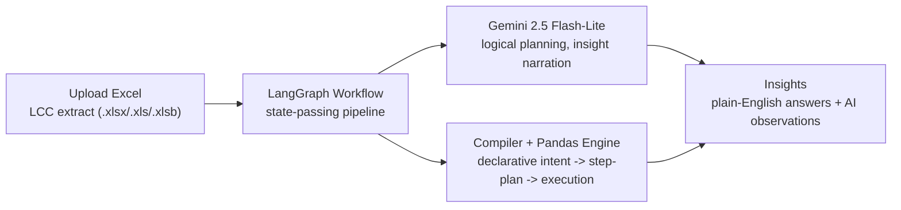

# AGENTS.md: CollectionIQ Agent System

A system-design overview of the AI agent pipelines that power CollectionIQ's plain-English portfolio queries and monthly reports.

---

## What It Delivers

- Reduced portfolio reporting from a multi-step analyst request cycle (hours to a day per question) to a self-serve answer in under 30 seconds.
- Verified column normalization at 100% accuracy across all 85 expected columns from raw LCC Excel extracts, handling truncated headers, trailing spaces, casing differences, and multi-sheet workbooks automatically.
- Generates a board-ready monthly portfolio report from up to 18 independently toggleable sections (verdict-first AI narrative, embedded charts, risk signals, region/segment breakdowns, branch and executive leaderboards) in one click, replacing a manual end-of-month compilation.
- 613 automated tests cover every pandas/business-logic path (bucketing, KPI computation, the 7-tier priority framework, bucket migration, the compiler/registry layer, every report section) with zero live LLM calls, so the full regression suite runs in seconds.
- Each plain-English query resolves through 2 sequential LLM calls (occasionally a 3rd repair call on a compile error), or just 1 if the user leaves the AI Query tab's "Generate AI summary" checkbox unchecked (off by default) to skip the narrative-writing call entirely; choosing Gemini 2.5 Flash-Lite over a heavier model keeps total query latency in the single-digit-second range even under concurrent users.

---

## Architecture

```mermaid
flowchart LR
    A["Upload Excel\nLCC extract (.xlsx/.xls/.xlsb)"] --> B["LangGraph Workflow\nstate-passing pipeline"]
    B --> C["Gemini 2.5 Flash-Lite\nlogical planning, insight narration"]
    B --> D["Compiler + Pandas Engine\ndeclarative intent -> step-plan -> execution"]
    C --> E["Insights\nplain-English answers + AI observations"]
    D --> E
```

The query pipeline is a **"logical plan, then compile" design**: the LLM never writes execution logic. It emits a declarative intermediate representation (IR-1) — which filters, which metrics, which dimensions, picked from a fixed registry vocabulary — and a deterministic compiler lowers that into an ordered pandas step-plan. See `CLAUDE.md`'s "AI Query Architecture" section for the full 5-node breakdown (Logical Planner → Fast-Path View → Compiler and Validator → Data Executor → Insight Generator).

---

## Design Decisions (made before writing prompts)

1. **Cost/latency budget set the model choice.** A query touches the LLM 2 times per request (occasionally 3, with a repair call), on a shared multi-user dashboard; that constraint was fixed first, and it ruled out a heavier reasoning model (Gemini Flash-Lite chosen over Pro) before any prompt was drafted.
2. **Deterministic work stays out of the LLM.** Anything computable exactly (filtering, KPI math, the 7-tier priority framework, bucket migration, every report number) runs in pure pandas with no LLM involvement, so it's unit-testable and always correct regardless of model behavior. The LLM only ever picks names from a fixed vocabulary (`registry/`), never invents pandas code.
3. **Failure isolation by design.** Each LLM/pandas step is its own LangGraph node with a dedicated error path; a failure at any stage short-circuits to an error state instead of surfacing a partial or silently-wrong result. A malformed compile gets one repair attempt (the exact error text fed back to the planner) before giving up with a clear message, rather than a silent wrong answer.
4. **Free-text fields get substring matching, controlled-vocabulary fields get exact matching.** Person-name filters (`MNT NAME`, `Cust Name`, `Guar Name`) use `contains`, not `==` — a real name in the data can differ from how a user spells/types it, so an exact match on free text silently returns zero rows for someone who's actually there. Region/branch/status filters, which come from a fixed set of values, still use `==`.

---

## Agent Roster

| Agent | Engine | Role | Output |
|---|---|---|---|
| Logical Planner | Gemini 2.5 Flash-Lite | Reads the registry vocabulary (concepts, metrics, entities, dimensions, pre-built views) and the raw query; emits a declarative intent, never execution code | IR-1 (filters, dimensions, measures, view match, or a clarifying question) |
| Compiler and Validator | Deterministic, no LLM | Lowers IR-1 into an ordered pandas step-plan; validates every column/name reference against the real schema | Step-plan, or a validation error fed back for one repair attempt |
| Data Executor | Pandas, no LLM | Runs the step-plan, or the 7-tier priority framework for priority-action queries; computes KPIs and rankings | Result table + KPIs |
| Insight Generator | Gemini 2.5 Flash-Lite | Writes domain-aware bullet observations from the computed KPIs and rankings | 4-5 insight bullets |

A second, independent LangGraph pipeline follows the same node-and-state-passing pattern for the monthly report: Portfolio Analyzer (pandas, fans out into up to 18 toggleable sections) → Risk Narrator (Gemini, executive narrative + 5-point action plan) → Report Builder (Python, assembles the verdict-first self-contained HTML) → Email Dispatcher (SMTP, fires only if configured).

**Not on the live path**: `agents/domain_expert.py`'s old single-call `enrich_query` (superseded by the Logical Planner, though its `PRIORITY_RULES`/snapshot-context helpers are still live). `agents/query_parser.py`, `agents/plan_critic.py`, and half of `agents/data_executor.py` were a legacy pre-compiler architecture iteration and have been deleted entirely, along with their dedicated tests. See `CLAUDE.md` for the full detail.

---

## Tech Stack

| Layer | Technology |
|---|---|
| UI | Streamlit |
| Orchestration | LangGraph (StateGraph, conditional routing) |
| AI | Google Gemini 2.5 Flash-Lite |
| Data | Pandas |
| Charts | Plotly + Kaleido (PNG export for the HTML report) |
| Tracing | LangSmith |
