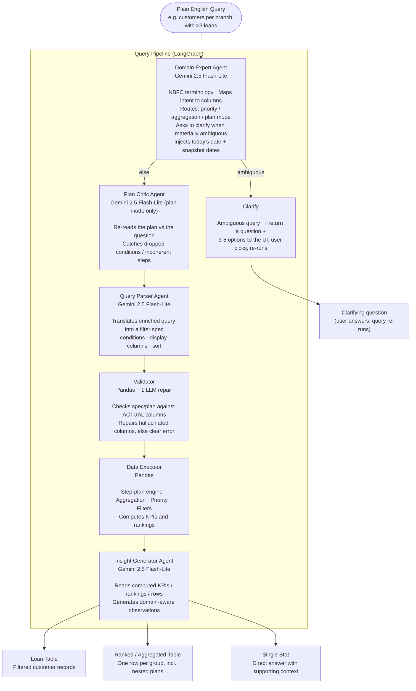
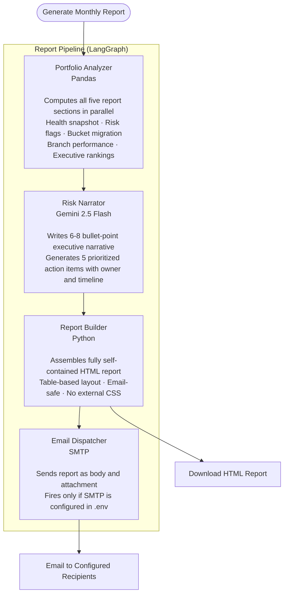
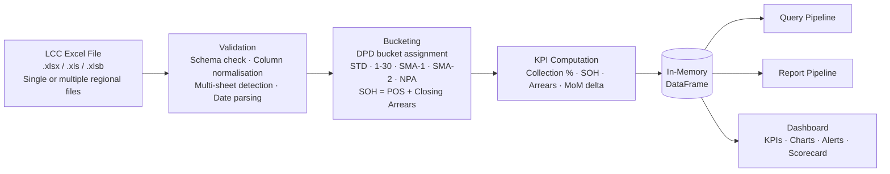

# CLAUDE.md: CollectionIQ

Guidance for AI assistants working in this repo.

## Quick Facts

- **Stack**: Streamlit (port from `.streamlit/config.toml`, currently 8503) + Pandas + Plotly + Google Gemini via `google-genai` + LangGraph
- **Run**: `streamlit run app.py` (config is `headless = true`, so no browser auto-opens - open the URL yourself)
- **Tests**: `pytest` (110 tests, all pandas/business-logic, no live Gemini calls). Engine tests live in `tests/test_plan_executor.py` (step-plan) and `tests/test_data_executor.py` (aggregation + filters + validators).
- **Model config**: `GEMINI_MODEL` is defined once in `config.py` and imported everywhere; never hardcode the model string in agent files
- **Data**: single in-memory pandas DataFrame per session, loaded from an uploaded LCC Excel extract (~85 known columns, see `utils.py::REQUIRED_COLS`). When a previous-period file is uploaded, `prev_bucket` is merged onto each row, enabling snapshot (then-vs-now) comparisons.

---

## What CollectionIQ Is

CollectionIQ is a self-serve portfolio intelligence dashboard for NBFC (Non-Banking Financial Company) loan collection teams. It solves the problem of collection leaders depending on analysts for every portfolio question. Upload a monthly LCC Excel extract and immediately get KPIs, risk alerts, an executive scorecard, bucket-migration analysis, and a plain-English query interface, all running locally on the in-memory DataFrame.

---

## Agent Architecture

The query pipeline is a LangGraph `StateGraph` in `graph.py`, sharing a single `QueryState` TypedDict that accumulates fields as it flows through. There are three LLM agents (Domain Expert, Query Parser, Insight Generator) plus an LLM Plan Critic, a deterministic pandas executor, and two control nodes (clarify, validate). The design goal is general, composable reasoning - **avoid per-question hardcoding/few-shot patches; add capabilities (primitives, controls), not one-off cases.**

### The nodes (in pipeline order)

1. **Domain Expert** (`agents/domain_expert.py::enrich_query`, Gemini)
   Enriches the raw query with NBFC context and decides how to answer. Outputs: `enriched_query`, `query_category`, `query_title`, `focus_kpis`, `insight_focus`, `risk_flag`, `result_type`, and the routing flags:
   - `priority_mode` (bool) - the 7-tier business priority framework
   - `aggregation_mode` (bool + `aggregation_spec`) - single-pass GROUP BY
   - `plan_mode` (bool + `plan`) - a multi-step plan for anything a single GROUP BY can't express
   - `needs_clarification` (bool + `clarification_question` + `clarification_options`) - set when the query is materially ambiguous
   It also injects today's date and, when a previous file is loaded, a SNAPSHOTS block mapping `prev_bucket`/`curr_bucket` to their actual dates so date references resolve deterministically. `allow_clarification=False` is passed on a re-run after the user has answered, so it never loops.

2. **Clarify** (`clarify_node`, terminal) - if `needs_clarification`, the graph routes here and returns the question + options to the UI without parsing or executing. The user picks an option; the UI re-runs the query with the choice appended and `allow_clarification=False`.

3. **Plan Critic** (`agents/plan_critic.py::critique_plan`, Gemini, **plan_mode only**) - re-reads the generated `plan` against the original question for completeness (did it drop a condition?) and coherence (does a step reference a column an earlier `group_aggregate` dropped?), returning a corrected plan. Non-fatal: any failure keeps the original plan; the deterministic validator is the safety net. Skipped for non-plan queries (cost discipline).

4. **Query Parser** (`agents/query_parser.py::parse_query`, Gemini) - converts `enriched_query` into a filter spec: `conditions`, `display_columns`, `sort_by`/`sort_asc`, `plain_english`. (Used by the filter path; runs for all queries but its output is only consumed when not in priority/aggregation/plan mode.)

5. **Validator** (`validate_node` in `graph.py`, deterministic + one LLM repair) - checks the active spec against the **actual** DataFrame columns: `validate_plan` (plan mode, column-tracking across steps), `validate_aggregation_spec` (aggregation), or `validate_filter_spec` (filter). On a mismatch it sends the error + the real column list back to the relevant agent for one repair attempt, then fails with a clear message rather than executing a wrong spec. Catches hallucinated columns / undefined aliases - *not* dropped conditions (that's the Critic's job).

6. **Data Executor** (`agents/data_executor.py` + `agents/plan_executor.py`, pure pandas, no LLM) - branches on the flags:
   - `plan_mode` → `plan_executor.execute_plan()`: runs the step plan (see below)
   - `priority_mode` → `execute_priority_mode()`: 7-tier framework
   - `aggregation_mode` → `execute_aggregation()`: counts / sums / derived metrics / HAVING / top-N `limit`
   - otherwise → `execute_filters()` via `_apply_condition`
   Then computes `result_kpis` and `result_rankings`.

7. **Insight Generator** (`agents/insight_generator.py::generate_insights`, Gemini) - reads the KPIs/rankings (or aggregated rows) and writes 4-5 domain-aware bullets.

### The step-plan engine (`agents/plan_executor.py`)

`plan_mode` exists because a single GROUP BY counts rows per group and cannot express nested analytics (e.g. "customers per branch with >3 loans"). A `plan` is an ordered list of typed steps; each transforms the previous step's DataFrame, so arbitrary depth composes without special-casing. Operations:
- `group_aggregate` - group by keys; aggregations `count|sum|nunique|mean|min|max`. Each aggregation may carry an optional `where` (conditional aggregation: count/sum only matching rows). A `group_aggregate` replaces the table with its group keys + new aliases.
- `filter` - row/group filter (per-entity thresholds live here)
- `derive` - add a computed column via `df.eval` over existing aliases
- `sort`, `limit`
`validate_plan` tracks the evolving column set step-by-step, so it catches a step that references a column an earlier step dropped. Whitelisted ops only - no arbitrary code execution.

### How they coordinate

- **State passing**: every node receives the full `QueryState` and returns `{**state, ...new_fields}`; state accumulates rather than being threaded as args. By the end, `QueryState` holds the full record of the query.
- **Graph shape**: linear with branch-outs and error short-circuits:
  ```
  START → expert ─┬─► clarify → END                              (ambiguous: ask, don't guess)
                  ├─► error → END
                  └─► critic → parse → validate → execute → analyze → END
                                  ↘        ↘          ↘
                                   error → error →  error → END
  ```
  `_route_expert` sends ambiguous queries to `clarify`, errors to `error`, else to `critic` (which is a pass-through unless `plan_mode`). `_route_parse`/`_route_validate`/`_route_execute` short-circuit to `error` on `state["error"]`.
- **LLM call count**: a simple query = 3 Gemini calls (expert, parse, analyze). A `plan_mode` query = 4 (adds the critic), +1 if the validator triggers a repair. An ambiguous query = 1 (expert only) until the user answers, then a fresh run. There is no function-calling/agentic tool loop; "routing" is the error/clarify branching plus `if/elif` inside `execute_node`.
- **Progress UI**: a `threading.local()`-based callback (`_announce`, driven by `_STEP_LABELS`) fires at each node so `app.py` can show live step labels via `st.status()`; thread-safe per Streamlit session.
- **Tracing**: every Gemini call is wrapped in `@traceable` (LangSmith); a `run_id` per query is returned to the UI for thumbs up/down feedback.

A second, independent LangGraph pipeline (`report_agent/graph.py`) follows the same state-passing pattern for the monthly HTML report: Portfolio Analyzer → Risk Narrator → Report Builder → Email Dispatcher.

---

## Architecture Diagrams

These mirror the diagrams in `README.md`; kept here too so an AI assistant has the visual system layout alongside the prose description above.

### Query Pipeline



### Report Pipeline

Triggered on demand. Runs fully autonomously, no user input needed after clicking Generate.



### Data Layer

Both pipelines operate on the same in-memory DataFrame loaded from the Excel upload. No database, no cloud storage. Data never leaves the machine.



---

## Model Choice: Gemini 2.5 Flash-Lite

`GEMINI_MODEL = "gemini-2.5-flash-lite"`, defined once in `config.py`.

**Why Flash-Lite, not Pro:**
- **Cost multiplies per query**: a simple query triggers 3 sequential Gemini calls (Domain Expert, Query Parser, Insight Generator); a `plan_mode` query adds the Plan Critic (4), plus one more if the Validator repairs. At Pro pricing that multiplies several-fold on every question. The Critic is therefore gated to `plan_mode` only - simple queries never pay for it.
- **Latency compounds**: the calls run sequentially, so total latency is additive. Flash-Lite keeps a full query in the few-second range; Pro's higher per-call latency would push a single query toward 10s+ before pandas even runs.
- **Task complexity matches Flash-Lite's strengths**: the LLM steps are domain-context injection (expert), structured JSON extraction against a fixed schema (parser/plan), self-review against an explicit checklist (critic), and templated bullet-writing from pre-computed numbers (insight). None need deep open-ended reasoning; correctness is enforced by the deterministic validator + executor, not by model depth.
- **Multi-user dashboard**: as a shared Streamlit deployment, every concurrent user's query is several calls. Flash-Lite's lower cost and higher throughput matter more here than at single-user scale.

---

## Example: Input → Agent Flow → Output

**Input** (AI Query tab): `"Show me co-lending accounts at risk in Pune"`

**1. Domain Expert** recognizes "co-lending at risk" as a known NBFC pattern and "Pune" as a region:
```json
{
  "enriched_query": "Find accounts with CoLending_Loans = Y and Arrears/EMI > 0, filtered to RegionName = PUNE; partner-bank co-lending accounts showing delinquency, highest SLA-breach priority.",
  "query_category": "risk",
  "priority_mode": false,
  "aggregation_mode": false,
  "insight_focus": "co-lending delinquency risk",
  "risk_flag": "critical"
}
```

**2. Query Parser** converts that into a filter spec:
```json
{
  "conditions": [
    {"column": "CoLending_Loans", "op": "==", "value": "Y"},
    {"column": "Arrears / EMI", "op": ">", "value": 0},
    {"column": "RegionName", "op": "==", "value": "PUNE"}
  ],
  "display_columns": ["Loan No", "Cust Name", "Cust Mob No", "RegionName", "Unit", "ARREARS AGAINST INST", "ARREARS AGAINST EXP", "Arrears / EMI", "SOH"],
  "sort_by": "SOH",
  "sort_asc": false,
  "plain_english": "Co-lending accounts in Pune showing delinquency, sorted by exposure"
}
```

**3. Data Executor**: both routing flags are `false`, so `execute_filters()` applies the 3 conditions to `df_curr` (e.g. 42 matching loans), then computes KPIs (total SOH at risk, count by branch/executive).

**4. Insight Generator** writes bullets such as:
- "42 co-lending accounts in Pune are currently delinquent, representing ₹X Cr in SOH exposure."
- "Branch X accounts for the largest share; prioritize field visits here this week."

**Output** (`ui/tabs/ai_query.py`): KPI summary row + the 42-row filtered table (sorted by SOH) + the AI bullet observations + an Excel download button.

---

## Example 2: Nested plan (`plan_mode`)

**Input**: `"number of customers each branch has with more than 3 loans"`

A single GROUP BY can't answer this - it needs a per-customer rollup, then a count of those customers per branch. The Domain Expert sets `plan_mode=true` and emits a `plan`:

```json
[
  {"op": "group_aggregate", "group_by": ["Unit", "Cust Mob No"],
   "aggregations": [{"alias": "loan_count", "func": "nunique", "column": "Loan No"}]},
  {"op": "filter", "conditions": [{"column": "loan_count", "op": ">", "value": 3}]},
  {"op": "group_aggregate", "group_by": ["Unit"],
   "aggregations": [{"alias": "customer_count", "func": "nunique", "column": "Cust Mob No"}]},
  {"op": "sort", "by": "customer_count", "ascending": false}
]
```

The **Plan Critic** checks it captures the full intent and that no step uses a dropped column; the **Validator** confirms every column exists; `execute_plan` runs the steps in order. Output: one row per branch with `customer_count`. The same engine handles deeper questions - e.g. "fleet owners (3+ loans) per branch who have 1 or more unpaid loans, with their unpaid count, by SOH" uses a conditional aggregation (`where`) + `derive` across five steps.

---

