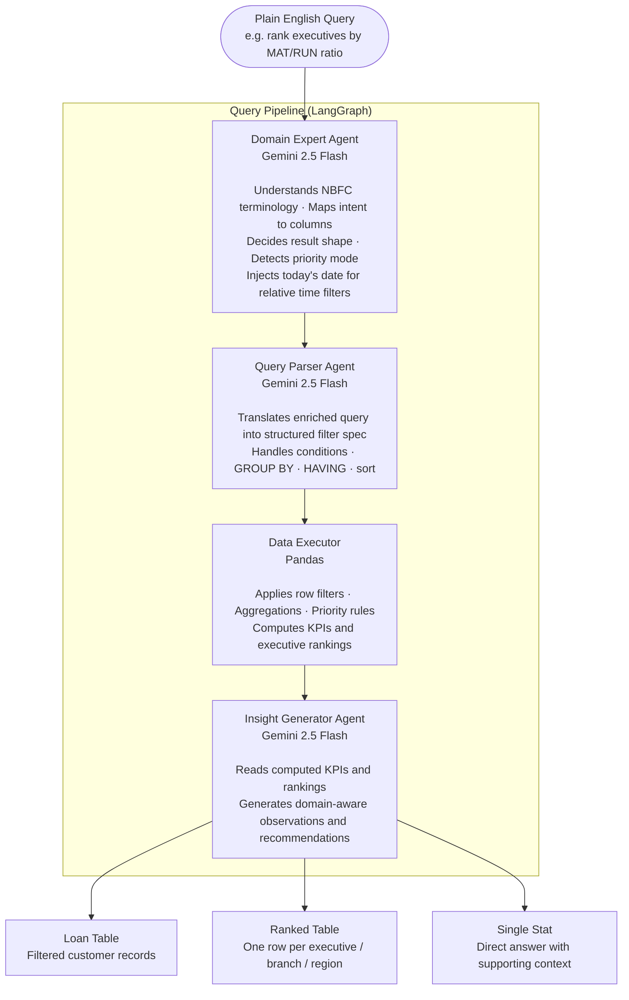
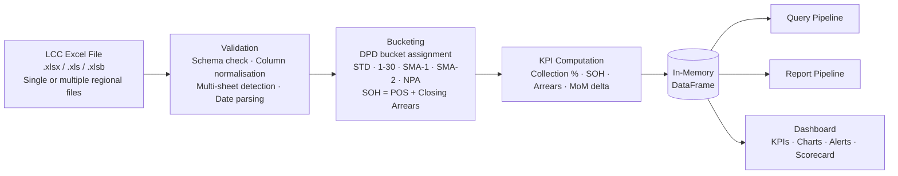

# CLAUDE.md: CollectionIQ

Guidance for AI assistants working in this repo.

## Quick Facts

- **Stack**: Streamlit (port 8502, see `.streamlit/config.toml`) + Pandas + Plotly + Google Gemini via `google-genai` + LangGraph
- **Run**: `streamlit run app.py`
- **Tests**: `pytest` (77 tests, all pandas/business-logic, no live Gemini calls)
- **Model config**: `GEMINI_MODEL` is defined once in `config.py` and imported everywhere; never hardcode the model string in agent files
- **Data**: single in-memory pandas DataFrame per session, loaded from an uploaded LCC Excel extract (~85 known columns, see `utils.py::REQUIRED_COLS`)

---

## What CollectionIQ Is

CollectionIQ is a self-serve portfolio intelligence dashboard for NBFC (Non-Banking Financial Company) loan collection teams. It solves the problem of collection leaders depending on analysts for every portfolio question. Upload a monthly LCC Excel extract and immediately get KPIs, risk alerts, an executive scorecard, bucket-migration analysis, and a plain-English query interface, all running locally on the in-memory DataFrame.

---

## Agent Architecture

Four agents, wired as a LangGraph `StateGraph` in `graph.py`, sharing a single `QueryState` TypedDict that accumulates fields as it flows through the pipeline.

### The four agents

1. **Domain Expert** (`agents/domain_expert.py::enrich_query`, Gemini)
   Takes the raw user query and enriches it with NBFC domain context. Outputs: `enriched_query`, `query_category`, `query_title`, `focus_kpis`, `insight_focus`, `risk_flag`, `result_type`, and two routing flags: `priority_mode` (bool) and `aggregation_mode` (bool + `aggregation_spec`).

2. **Query Parser** (`agents/query_parser.py::parse_query`, Gemini)
   Converts `enriched_query` into a structured JSON filter spec: `conditions` (column/op/value triples), `display_columns`, `sort_by`/`sort_asc`, `plain_english`.

3. **Data Executor** (`agents/data_executor.py`, pure pandas, no LLM)
   Branches on the flags the Domain Expert set:
   - `priority_mode=True` → `execute_priority_mode()`: the 7-tier business priority framework
   - `aggregation_mode=True` → `execute_aggregation()`: GROUP BY/HAVING-style logic from `aggregation_spec`
   - otherwise → `execute_filters()`: applies the Query Parser's `conditions` via `_apply_condition`
   Then computes `result_kpis` and `result_rankings`.

4. **Insight Generator** (`agents/insight_generator.py::generate_insights`, Gemini)
   Reads `result_kpis` + `result_rankings` + `insight_focus`, writes 4-5 bullet-point domain-aware observations.

### How they coordinate

- **State passing**: every node receives the full `QueryState` and returns `{**state, ...new_fields}`, state accumulates rather than being threaded as separate function args. By the end, `QueryState` holds the full record of the query: input, every agent's output, and the final result.
- **Graph shape**: a straight line with error short-circuits:
  ```
  START → expert → parse → execute → analyze → END
                ↘       ↘        ↘
                 error → error → error → END
  ```
  After every node, a conditional edge (`_route_expert`, `_route_parse`, `_route_execute`) checks `state["error"]`. If any agent set it, the graph jumps straight to an `error` node → `END`, skipping the remaining agents.
- **No LLM tool-calling**: Gemini is called 3 times (expert, parse, analyze), each as a single plain text-completion; there's no function-calling/agentic tool loop. "Routing" is just (a) the error short-circuit between nodes, and (b) plain `if/elif` branching *inside* `execute_node` based on the `priority_mode`/`aggregation_mode` booleans.
- **Progress UI**: a `threading.local()`-based callback (`_announce`, driven by `_STEP_LABELS`) fires at the start of each node so `app.py` can show live step labels via `st.status()`; thread-safe per Streamlit session.
- **Tracing**: every Gemini call is wrapped in `@traceable` (LangSmith); a `run_id` is generated per query and returned to the UI for thumbs up/down feedback.

A second, independent LangGraph pipeline (`report_agent/graph.py`) follows the same state-passing pattern for the monthly HTML report: Portfolio Analyzer → Risk Narrator → Report Builder → Email Dispatcher.

---

## Architecture Diagrams

These mirror the diagrams in `README.md`; kept here too so an AI assistant has the visual system layout alongside the prose description above.

### Query Pipeline



### Report Pipeline

Triggered on demand. Runs fully autonomously, no user input needed after clicking Generate.


### Data Layer

Both pipelines operate on the same in-memory DataFrame loaded from the Excel upload. No database, no cloud storage. Data never leaves the machine.



---

## Model Choice: Gemini 2.5 Flash

`GEMINI_MODEL = "gemini-2.5-flash"`, defined once in `config.py`.

**Why Flash, not Pro:**
- **Cost multiplies per query**: a single AI Query call triggers 3 sequential Gemini calls (Domain Expert, Query Parser, Insight Generator). At Pro pricing that's 3x the cost of Flash, every time a user types a question.
- **Latency compounds**: the 3 calls run sequentially, so total latency is additive. Flash keeps a full query in the few-second range; Pro's higher per-call latency would push a single query toward 10s+ before pandas even runs.
- **Task complexity matches Flash's strengths**: none of the 3 LLM steps need deep multi-step reasoning. They're domain-context injection (expert), structured JSON extraction against a fixed schema (parser), and templated bullet-point writing from pre-computed KPIs (insight generator). Pro's extra reasoning depth wouldn't materially improve these outputs.
- **Multi-user dashboard**: as a shared Streamlit deployment, every concurrent user's query is 3 calls. Flash's lower cost and higher throughput matter more here than at single-user scale.

---

## Example: Input → Agent Flow → Output

**Input** (AI Query tab): `"Show me co-lending accounts at risk in Pune"`

**1. Domain Expert** recognizes "co-lending at risk" as a known NBFC pattern and "Pune" as a region:
```json
{
  "enriched_query": "Find accounts with CoLending_Loans = Y and Arrears/EMI > 0, filtered to RegionName = PUNE; partner-bank co-lending accounts showing delinquency, highest SLA-breach priority.",
  "query_category": "risk",
  "priority_mode": false,
  "aggregation_mode": false,
  "insight_focus": "co-lending delinquency risk",
  "risk_flag": "critical"
}
```

**2. Query Parser** converts that into a filter spec:
```json
{
  "conditions": [
    {"column": "CoLending_Loans", "op": "==", "value": "Y"},
    {"column": "Arrears / EMI", "op": ">", "value": 0},
    {"column": "RegionName", "op": "==", "value": "PUNE"}
  ],
  "display_columns": ["Loan No", "Cust Name", "Cust Mob No", "RegionName", "Unit", "ARREARS AGAINST INST", "ARREARS AGAINST EXP", "Arrears / EMI", "SOH"],
  "sort_by": "SOH",
  "sort_asc": false,
  "plain_english": "Co-lending accounts in Pune showing delinquency, sorted by exposure"
}
```

**3. Data Executor**: both routing flags are `false`, so `execute_filters()` applies the 3 conditions to `df_curr` (e.g. 42 matching loans), then computes KPIs (total SOH at risk, count by branch/executive).

**4. Insight Generator** writes bullets such as:
- "42 co-lending accounts in Pune are currently delinquent, representing ₹X Cr in SOH exposure."
- "Branch X accounts for the largest share; prioritize field visits here this week."

**Output** (`ui/tabs/ai_query.py`): KPI summary row + the 42-row filtered table (sorted by SOH) + the AI bullet observations + an Excel download button.

---

