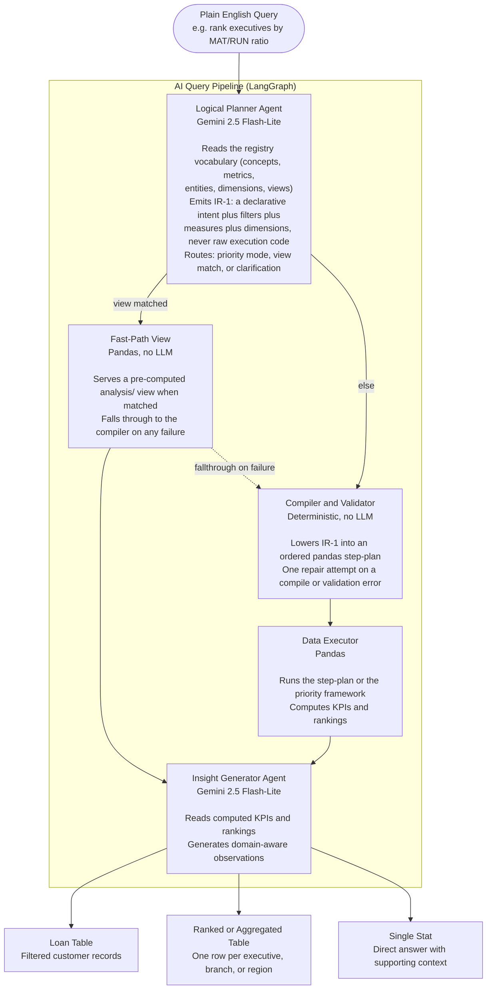
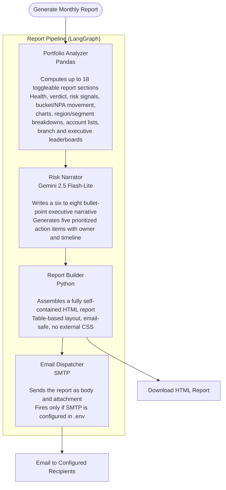
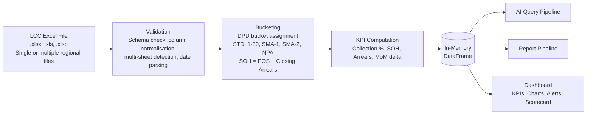

# CLAUDE.md: CollectionIQ

Guidance for AI assistants working in this repo.

## Quick Facts

- **Stack**: Streamlit (default port, no override in `.streamlit/config.toml` — a hardcoded `port` there has broken the Streamlit Cloud health check twice before by not matching the port Cloud's prober expects; if you need a custom port for local dev, set it via `streamlit run app.py --server.port XXXX` on the command line instead of committing it to config.toml) + Pandas + Plotly + Google Gemini via `google-genai` + LangGraph
- **Run**: `streamlit run app.py`
- **Tests**: `pytest` (613 tests, all pandas/business-logic, no live Gemini calls)
- **Model config**: `GEMINI_MODEL` is defined once in `config.py` (currently `gemini-2.5-flash-lite`) and imported everywhere; never hardcode the model string in agent files
- **Data**: single in-memory pandas DataFrame per session, loaded from an uploaded LCC Excel extract (~85 known columns, see `utils.py::REQUIRED_COLS`)

---

## What CollectionIQ Is

CollectionIQ is a self-serve portfolio intelligence dashboard for NBFC (Non-Banking Financial Company) loan collection teams. It solves the problem of collection leaders depending on analysts for every portfolio question. Upload a monthly LCC Excel extract and immediately get KPIs, risk alerts, an executive scorecard, bucket-migration analysis, and a plain-English query interface, all running locally on the in-memory DataFrame.

---

## Analysis Layer (`analysis/`)

Pre-computed, pure pandas, no LLM. These functions run once per upload (cached via `st.cache_data` in `app.py`) and feed both the dashboard tabs and, through `registry/views.py`, the AI Query fast path, so a dashboard number and an AI Query answer about the same thing are numerically identical.

- **`analysis/portfolio_intelligence.py`**: the largest module, computing most of the Portfolio Intelligence and Alerts content: `compute_pulse_kpis` (headline KPI cards with month-over-month deltas), `compute_region_scorecard` / `compute_branch_quadrant` / `compute_executive_recovery` (per-entity performance tables), `compute_top_accounts` (top N by SOH restricted to delinquent accounts only, any non-STD bucket, since a large healthy STD loan is not a collections priority), `compute_fleet_exposure` (customers at or above `FLEET_MIN_LOANS` loans), `compute_risk_indicators` (signal-direction table gated by `RISK_INDICATOR_STABLE_PP`/materiality thresholds), `compute_good_bad` (synthesizes a good/bad narrative from a branch's composite Concern Score plus region NPA delta plus executive net recovery plus risk indicators), `compute_repossession_list`, `compute_good_customers`, `compute_product_analysis`, `compute_npa_sma2_comparison`, plus several Plotly chart builders (bucket waterfall, roll-rate heatmap, concentration treemap, vintage chart).
- **`analysis/executive_scorecard.py`**: `compute_executive_scorecard`, ranks every field executive by collection percentage with quartile-based performance tiers computed relative to the current dataset, not hardcoded thresholds. `rank_by_metric(scorecard_df, metric_col)` re-sorts an already-computed scorecard by any other column (currently `"Strike Rate %"`, exposed as a toggle on the Scorecard tab and as a second report section) and recomputes quartile tiers relative to that column, without mutating or re-deriving the original Collection%-ranked scorecard.
- **`analysis/roll_rate.py`**: the bucket-migration matrix and roll-forward/roll-backward rate KPIs between two uploaded periods.

**Business rules worth knowing**: SOH (Sum of Hire = POS + Closing Arrears) is the exposure metric used everywhere instead of raw POS, so MAT and S&S accounts (where POS is legitimately 0) still show their true outstanding exposure. Hard Bucket percentage means `Arrears / EMI >= HARD_BUCKET_ARREARS_EMI_MIN` (currently 6), a single config constant in `config.py` shared by both the dashboard and the AI Query registry's `hard_bucket_pct` metric, since these two previously drifted (one used 3, the other 6) before being unified. Nearly every threshold that used to be a bare magic number (`FLEET_MIN_LOANS`, `REPOSSESSION_WINDOW_MONTHS`, `GOOD_CUSTOMER_MIN_TENURE_PCT`, `CONCERN_SCORE_*`, `RISK_INDICATOR_*`, and more) now lives in `config.py`, and the matching UI label text reads from the same constants so a retuned threshold cannot silently go stale in a label.

**`strike_pct` / `hard_bucket_pct`**: computed by `utils.compute_strike_pct()` / `utils.compute_hard_bucket_pct()`, the single shared source of truth called by `utils.py::compute_metrics` (dashboard) and every Portfolio Intelligence table that reports either metric (`compute_pulse_kpis`, `compute_region_scorecard`, `compute_branch_quadrant`, `analysis/executive_scorecard.py::compute_executive_scorecard`). The AI Query pipeline can't call these directly, its `registry/ontology.py` `strike_pct`/`hard_bucket_pct` METRICs are declarative definitions consumed by `compiler/measures.py`'s `count_ratio` handler, a different execution path entirely, so it's a second, independent implementation of the same business rule by necessity of the architecture. `tests/test_metric_consistency.py` runs both paths against the same data and asserts they agree, so a retuned threshold that only reaches one side fails a test instead of silently drifting.

**`compute_pulse_kpis`'s `delta` contract**: always the RAW `(curr - prev)` movement, never sign-flipped for `inverse` metrics — `ui/components.py::_kpi_card_html` derives arrow direction purely from that raw sign and uses `inverse` only to pick the color. Pre-flipping the delta upstream *and* relying on `_kpi_card_html`'s own `inverse` color logic is a double sign-flip (a real bug this project shipped and fixed — see `project_guide.md` Phase 7 G4): arrow direction and color both end up backwards. `good_override` (also on `_kpi_card_html`) exists for metrics where "which direction is good" isn't fixed by sign alone (e.g. SOH — rising is good if POS growth drives it, bad if Closing Arrears growth drives it).

---

## Dashboard UI Layer (`app.py`, `ui/`)

- **Tab switching**: `app.py` uses a manual `st.segmented_control` + `if active == "label": render_x(...)` chain, **not** `st.tabs()`. `st.tabs()` renders every tab's UI on every rerun regardless of visibility (real latency cost) and has a known Streamlit bug where its panel-hiding JS desyncs, especially with spinners inside tabs (AI Query, Report both use them) — every tab's content ends up stacked as one long page. Don't reintroduce `st.tabs()` for the main tab bar.
- **`st.cache_data` returns a fresh object on every call, cache hit or not** — proven directly, not assumed. Never key a cache on `df is` some-earlier-object; it will silently never hit. `ui/components.py::_excel_bytes` is `@st.cache_data` itself (content-hashed) rather than a hand-rolled identity check, for this reason.

---

## AI Query Architecture (`graph.py`)

The AI Query pipeline is a LangGraph `StateGraph` sharing one `QueryState` TypedDict that accumulates fields as it flows through the graph. It is a "logical plan, then compile" design: an LLM never authors execution logic directly, it emits a declarative intermediate representation (IR-1), and a deterministic compiler lowers that into a pandas step-plan.

### The nodes

1. **Logical Planner** (`agents/logical_planner.py::plan_logical`, Gemini)
   Reads the raw query plus a vocabulary catalog (`registry/ontology.py`'s `CONCEPTS`/`METRICS`, `registry/semantic_model.py`'s `ENTITIES`/`DIMENSIONS`, `registry/views.py`'s `VIEWS`) and emits IR-1: a flat JSON with `intent`, `filters`, `entity_filters`, `dimensions`, `measures`, `time`, `view`, and clarification fields. It never writes execution code, only picks names from the vocabulary.

2. **Fast-Path View** (`graph.py::view_node`, pandas, no LLM)
   If the Logical Planner matched a `VIEWS` entry, this node fetches or recomputes that pre-built business view (executive scorecard, roll-rate matrix, top delinquent accounts, and so on) instead of going through the general compiler. It reuses `app.py`'s already-cached `analysis/` results where possible, so the AI Query answer stays numerically identical to what the dashboard tabs already show. Any failure to serve the view (unknown name, missing previous-period file, an unsupported filter) clears `ir1["view"]` and falls through to the compiler path with the same IR-1, rather than erroring out.

3. **Compiler and Validator** (`compiler/core.py::compile_logical`, deterministic, no LLM)
   Lowers IR-1 into an ordered pandas step-plan (`group_aggregate`, `filter`, `derive`, `sort`, `limit`, `select`), resolving concept/metric/entity/dimension names against the registry and validating every column reference. On a compile or validation error, one repair attempt re-runs the Logical Planner with the exact error text as feedback before giving up.

4. **Data Executor** (`agents/plan_executor.py::execute_plan`, pure pandas, no LLM)
   Runs the step-plan against the full DataFrame. Priority-action queries bypass the compiler and go straight to `agents/data_executor.py::execute_priority_mode` (the seven-tier business priority framework). Both paths finish by computing `result_kpis` and `result_rankings`.

5. **Insight Generator** (`agents/insight_generator.py::generate_insights`, Gemini)
   Reads `result_kpis` plus `result_rankings` plus `insight_focus`, writes four to five bullet-point domain-aware observations. Skipped entirely when `run_query(..., skip_insights=True)` — the AI Query tab's "Generate AI summary" checkbox, off by default — is set; `result_df`/`result_kpis`/`result_highlights` are unaffected, only the written narrative is skipped.

Only two Gemini calls happen per query: the Logical Planner and the Insight Generator (plus, rarely, one repair call to the Logical Planner if compilation fails the first time) — one when `skip_insights=True`.

### How they coordinate

- **State passing**: every node receives the full `QueryState` and returns `{**state, ...new_fields}`. State accumulates rather than being threaded as separate function arguments.
- **Graph shape**:
  ```
  START -> planner -> view -> compile -> execute -> analyze -> END
                  \      \        \         \
                clarify  compile  error     error
                   |        |
                  END      error -> END
  ```
  `_route_planner` sends priority-action queries straight to execute (bypassing compile), sends a matched view to `view`, sends an ambiguous query to `clarify`, and sends everything else to `compile`. `_route_view` sends a successfully served view to `analyze`, and any view failure back to `compile` (the fallthrough). `_route_compile` and `_route_execute` short-circuit to an `error` node on any set `state["error"]`.
- **Vocabulary, not logic, in the LLM**: `registry/ontology.py` defines `CONCEPTS` (named filter predicates, for example `no_collection`, `easy_settlement`), `METRICS` (named aggregations, including the `count_ratio` kind used for `strike_pct` and `hard_bucket_pct`), `ENTITY_CONCEPTS` (per-entity rollup predicates, for example `fleet_operator`), and `PRIORITY_RULES` (the seven-tier framework). `registry/semantic_model.py` defines `ENTITIES` (grain: loan, customer, executive, branch, region) and `DIMENSIONS` (group-by aliases). `registry/views.py` defines `VIEWS`, the fast-path catalog described above. The Logical Planner picks names from these four vocabularies; it never invents pandas code.
- **Progress UI**: a `threading.local()`-based callback (`_announce`, driven by `_STEP_LABELS`) fires at the start of each node so `app.py` can show live step labels via `st.status()`, thread-safe per Streamlit session.
- **Tracing**: every node in `graph.py` (not just the two Gemini calls) is wrapped in `@traceable` (LangSmith) for observability into routing decisions, view cache hits, and compiler repair attempts, and a `run_id` is generated per query and returned to the UI for thumbs up and thumbs down feedback. `QueryState` carries the full uploaded DataFrame (`result_df_full`) plus `df_prev`/`precomputed_views`/`result_df`, and LangGraph's own tracing serializes the complete state on every node transition regardless of what any individual `@traceable` wrapper does — on a real ~60k-row file this produced 20-85MB trace payloads against LangSmith's 20MB limit, so every trace failed to upload and retried repeatedly, adding tens of seconds of pure network overhead per query. Fixed by never putting those large objects in `state` at all: `run_query` stashes them in a `threading.local()` side channel (`_stash_large`/`_fetch_large`) keyed per-thread (matching the existing `_announce` step-callback pattern — one query runs synchronously per thread), and every node reads them back via `_fetch_large` instead of `state.get(...)`. `process_inputs`/`process_outputs` on each `@traceable` node additionally strip these fields before LangSmith ever serializes anything, as a second, independent layer.
- **Guardrails**: `agents/logical_planner.py` enforces a query-length cap (`MAX_QUERY_CHARS`), returns a structured out-of-scope response for gibberish or off-topic input instead of calling Gemini, and resists prompt injection via an explicit prompt instruction. `agents/plan_executor.py` blocks dunder/sandbox-escape patterns in `derive` expressions at both compile time (`validate_plan`) and execute time (`_op_derive`), as two independent layers.
- **Person-name filters** (`MNT NAME`, `Cust Name`, `Guar Name`): the planner is instructed to use `contains` (case-insensitive substring), never `==`. These are free text typed once at loan origination, not a controlled vocabulary like `RegionName`/`Unit`, so an exact match silently returns zero rows for a real person whose name in the data has any spelling/spacing variance from how the user types it. `agents/data_executor.py::_apply_condition` raises (rather than silently returning the full unfiltered table) if `contains` or any other op is ever misapplied to a numeric/date column, since nothing scopes the op to a column type beyond the prompt's own naming guidance.

A second, independent LangGraph pipeline (`report_agent/graph.py`) follows the same node-and-state-passing pattern for the monthly HTML report: Portfolio Analyzer -> Risk Narrator -> Report Builder -> Email Dispatcher.

### Files that look related but are not on the live path

`agents/domain_expert.py`'s `enrich_query`/`SYSTEM_PROMPT` (the old single-call architecture) is dead code, superseded by `agents/logical_planner.py`. The module's `PRIORITY_RULES` re-export, `build_snapshot_context`, and `_build_priority_text` are still live and imported by `agents/logical_planner.py` and `agents/data_executor.py`.

`agents/query_parser.py`, `agents/plan_critic.py`, and roughly half of `agents/data_executor.py` (`execute_filters`, `execute_aggregation`, `validate_aggregation_spec`, `validate_filter_spec`) were from an earlier architecture iteration, fully unreferenced by `graph.py` or any other live module, and kept alive only by older test files. All were deleted along with their dedicated tests; the scenarios they covered (`colending_at_risk` concept expansion, `HAVING` clause handling, an amount-reduction ranking) are independently covered live in `tests/test_compiler.py`, `tests/test_nested.py`, and `tests/test_temporal.py`.

---

## Report Layer (`report_agent/`)

Same 4-node LangGraph shape as CLAUDE.md's AI Query section above (Portfolio Analyzer -> Risk Narrator -> Report Builder -> Email Dispatcher), but the Portfolio Analyzer node now fans out into **18 independently toggleable sections**, each a thin `report_agent/sections/<name>.py` wrapper around an `analysis/` function (so a report number and a dashboard number are computed by the literal same code, not just "kept in sync"). `report_agent/nodes/portfolio_analyzer.py`'s `_SECTION_FN` dict, `report_agent/graph.py`'s `ALL_SECTIONS` list, `report_agent/nodes/report_builder.py`'s `SECTION_ORDER`/`_RENDERERS` dicts, and `ui/tabs/report.py`'s checkboxes must all agree on the same section-name set, four separate registration points for one addition, it's easy to add a section and forget one of the four.

**Layout is verdict-first**: the Gemini executive narrative and prioritized action plan render immediately after the header, before any KPI or table, so a lead gets the TL;DR before scrolling into supporting detail. `report_agent/charts.py::fig_to_base64` renders three of the sections' Plotly figures to embedded base64 PNG (bucket waterfall, concentration treemap, branch quadrant scatter) via `kaleido`, so the report stays a single self-contained HTML file with no external image hosting.

The 18 sections, in render order:

| Section | What it shows |
|---|---|
| `portfolio_health` | Headline KPI cards (Month Demand, Collection %, Strike %, NPA %, Hard Bucket %, SOH, LCC%, CMD %) with MoM deltas |
| `verdict` | Pandas-computed good/bad synthesis (`analysis/portfolio_intelligence.py::compute_good_bad`) — works even with AI narrative skipped |
| `risk_flags` | Top 3 active smart alerts by severity |
| `risk_indicators` | Early-warning signal table (SMA-1/SMA-2 pool, fresh NPA formation, chronic defaulters, non-starters, co-lending risk) |
| `bucket_migration` | Roll-rate matrix + embedded bucket-distribution waterfall chart |
| `npa_sma2_movement` | This-month-vs-last-month NPA/SMA-2 counts, deltas, %change — portfolio total, then by region, then top-mover tables by branch and by executive |
| `branch_quadrant` | Embedded Collection% vs NPA% scatter (bubble = SOH) + top-5 highest-concern branches as a text fallback |
| `concentration` | Embedded region→branch treemap (size = SOH, color = NPA%) |
| `region_scorecard` | Per-region NPA%/Collection%/Hard Bucket%/SOH with MoM status |
| `product_analysis` | Segment-wise NPA breakdown (fuel type/source/vintage cohort intentionally excluded from the report) |
| `top_accounts` | Largest single exposures among delinquent (non-STD) accounts by SOH |
| `fleet_exposure` | Customers with 3+ loans (report-layer-only Region/Branch lookup, since the underlying analysis function groups by mobile number alone) |
| `repossession` | SMA-2/NPA accounts on loans still within the repossession collateral-value window |
| `good_customers` | Refinance/retention targets (tenure ≥70% completed, LCC% ≥100%) — always renders, with an explicit "no accounts meet criteria" message when empty rather than silently vanishing |
| `branch_performance` | Branch league table, top 5 / bottom 5 by Collection % |
| `executive_recovery` | Rescued-vs-slipped leaderboard (`analysis/portfolio_intelligence.py::compute_executive_recovery`) — a behavior signal distinct from plain Collection % |
| `executive_rankings` | Field executive league table, ranked by Collection % |
| `executive_strike_rankings` | Same executive pool, re-ranked by Strike % via `rank_by_metric` — independent section, doesn't replace the Collection%-ranked one |

**HTML escaping**: every renderer in `report_agent/nodes/report_builder.py` passes raw data (customer/executive/branch/region names, vehicle descriptions, the Gemini narrative/action-plan text) through `_esc()` (`html.escape`) before interpolating into an f-string. Manually-entered LCC fields can contain `&`/`<`/`>`; unescaped, those break the surrounding table markup, and the report is also offered as a raw `.html` download/email attachment, not just rendered inside an email client's sandboxed viewer.

---

## Architecture Diagrams

These mirror the diagrams in `README.md`, kept here too so an AI assistant has the visual system layout alongside the prose description above.

### Query Pipeline


```mermaid
flowchart TD
    User(["Plain English Query\ne.g. rank executives by MAT/RUN ratio"])

    User --> LP

    subgraph QP ["  AI Query Pipeline  (LangGraph)  "]
        direction TB
        LP["Logical Planner Agent\nGemini 2.5 Flash-Lite\n\nReads the registry vocabulary (concepts, metrics,\nentities, dimensions, views)\nEmits IR-1: a declarative intent plus filters plus\nmeasures plus dimensions, never raw execution code\nRoutes: priority mode, view match, or clarification"]
        VW["Fast-Path View\nPandas, no LLM\n\nServes a pre-computed analysis/ view when matched\nFalls through to the compiler on any failure"]
        CV["Compiler and Validator\nDeterministic, no LLM\n\nLowers IR-1 into an ordered pandas step-plan\nOne repair attempt on a compile or validation error"]
        EX["Data Executor\nPandas\n\nRuns the step-plan or the priority framework\nComputes KPIs and rankings"]
        IG["Insight Generator Agent\nGemini 2.5 Flash-Lite\n\nReads computed KPIs and rankings\nGenerates domain-aware observations"]
        LP -->|view matched| VW --> IG
        LP -->|else| CV --> EX --> IG
        VW -.fallthrough on failure.-> CV
    end

    IG --> R1["Loan Table\nFiltered customer records"]
    IG --> R2["Ranked or Aggregated Table\nOne row per executive, branch, or region"]
    IG --> R3["Single Stat\nDirect answer with supporting context"]
```

### Report Pipeline

Triggered on demand. Runs fully autonomously, no user input needed after clicking Generate.


```mermaid
flowchart TD
    Trigger(["Generate Monthly Report"])

    Trigger --> PA

    subgraph RP ["  Report Pipeline  (LangGraph)  "]
        direction TB
        PA["Portfolio Analyzer\nPandas\n\nComputes up to 18 toggleable report sections\nHealth, verdict, risk signals, bucket/NPA movement,\ncharts, region/segment breakdowns, account lists,\nbranch and executive leaderboards"]
        RN["Risk Narrator\nGemini 2.5 Flash-Lite\n\nWrites a six to eight bullet-point executive narrative\nGenerates five prioritized action items with owner and timeline"]
        RB["Report Builder\nPython\n\nAssembles a fully self-contained HTML report\nTable-based layout, email-safe, no external CSS"]
        ED["Email Dispatcher\nSMTP\n\nSends the report as body and attachment\nFires only if SMTP is configured in .env"]
        PA --> RN --> RB --> ED
    end

    RB --> DL["Download HTML Report"]
    ED --> EM["Email to Configured Recipients"]
```

### Data Layer

Both pipelines operate on the same in-memory DataFrame loaded from the Excel upload. No database, no cloud storage. Data never leaves the machine.


```mermaid
flowchart LR
    XL["LCC Excel File\n.xlsx, .xls, .xlsb\nSingle or multiple regional files"] --> VAL["Validation\nSchema check, column normalisation,\nmulti-sheet detection, date parsing"]
    VAL --> BK["Bucketing\nDPD bucket assignment\nSTD, 1-30, SMA-1, SMA-2, NPA\nSOH = POS + Closing Arrears"]
    BK --> KPI["KPI Computation\nCollection %, SOH, Arrears, MoM delta"]
    KPI --> DF[("In-Memory\nDataFrame")]
    DF --> QP2["AI Query Pipeline"]
    DF --> RP2["Report Pipeline"]
    DF --> DB["Dashboard\nKPIs, Charts, Alerts, Scorecard"]
```

---

## Model Choice: Gemini 2.5 Flash-Lite

`GEMINI_MODEL = "gemini-2.5-flash-lite"`, defined once in `config.py`.

**Why Flash-Lite, not Pro:**
- **Cost multiplies per query**: a single AI Query call triggers up to 2 sequential Gemini calls (Logical Planner, Insight Generator), plus an occasional third repair call. At Pro pricing that is several times the cost of Flash-Lite, every time a user types a question.
- **Latency compounds**: calls run sequentially, so total latency is additive. Flash-Lite keeps a full query in the few-second range; Pro's higher per-call latency would push a single query well past that before pandas even runs.
- **Task complexity matches Flash-Lite's strengths**: neither Gemini step needs deep multi-step reasoning. The Logical Planner does structured extraction against a fixed, registry-driven schema; the Insight Generator does templated bullet-point writing from pre-computed KPIs. Pro's extra reasoning depth would not materially improve either output.
- **Multi-user dashboard**: as a shared Streamlit deployment, every concurrent user's query is 2 or 3 calls. Flash-Lite's lower cost and higher throughput matter more here than at single-user scale.

---

## Example: Input to Agent Flow to Output

**Input** (AI Query tab): `"Show me co-lending accounts at risk in Pune"`

**1. Logical Planner** recognizes "co-lending at risk" as a registered `CONCEPTS` entry and "Pune" as a region filter, and finds no matching `VIEWS` entry (this is a novel ad-hoc filter, not a pre-built view):
```json
{
  "intent": "loan_table",
  "description": "Co-lending accounts in Pune showing delinquency, sorted by exposure",
  "filters": [
    {"concept": "colending_at_risk"},
    {"column": "RegionName", "op": "==", "value": "PUNE"}
  ],
  "dimensions": [],
  "measures": [],
  "view": null,
  "query_category": "risk",
  "query_title": "Co-lending Risk in Pune",
  "risk_flag": "critical"
}
```

**2. Compiler and Validator** lowers this into a step-plan (a `filter` step expanding the `colending_at_risk` concept into its underlying column conditions, plus the region filter), validated against the DataFrame's actual columns.

**3. Data Executor** runs the step-plan against `df_curr` (for example 42 matching loans), then computes KPIs (total SOH at risk, count by branch and executive) and contextual rankings.

**4. Insight Generator** writes bullets such as:
- "42 co-lending accounts in Pune are currently delinquent, representing roughly X Cr in SOH exposure."
- "Branch X accounts for the largest share, prioritize field visits here this week."

**Output** (`ui/tabs/ai_query.py`): KPI summary row, the 42-row filtered table sorted by SOH, the AI bullet observations, and an Excel download button.

---
