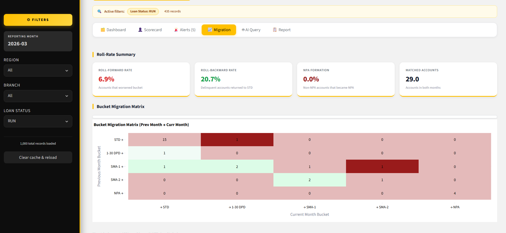
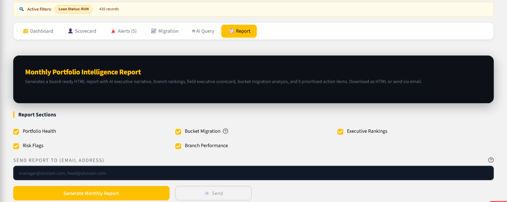
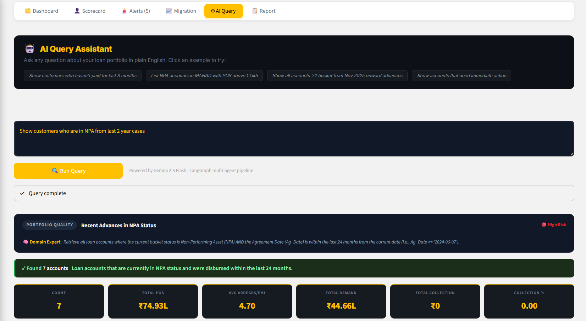
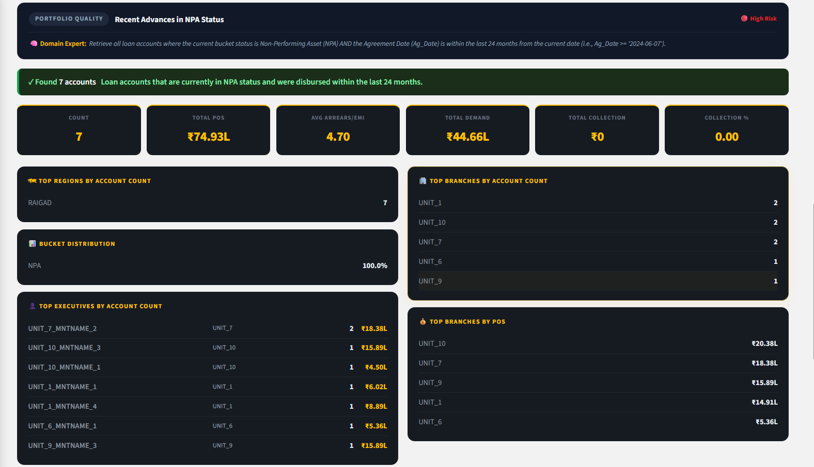
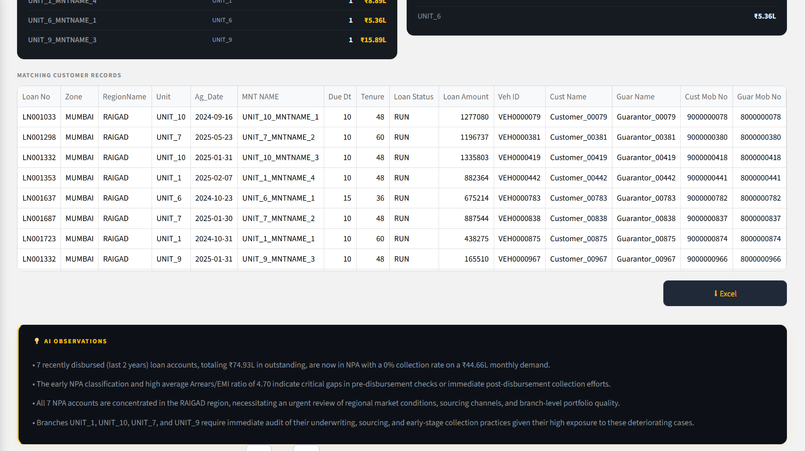
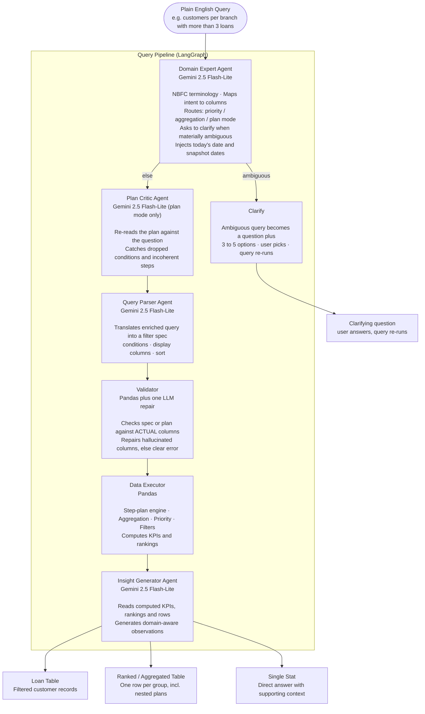
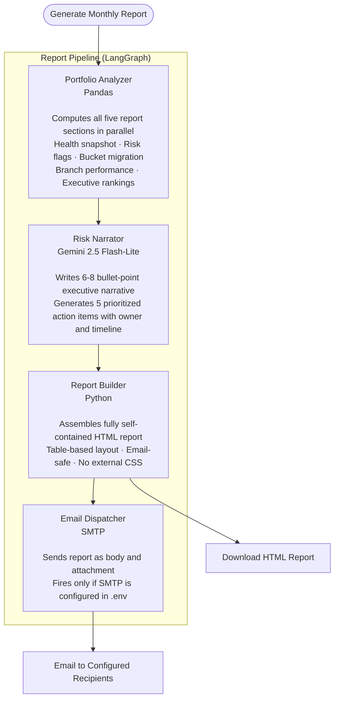
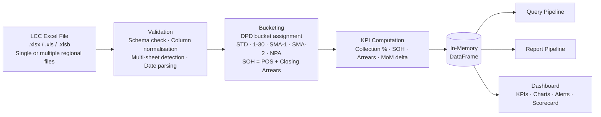

# CollectionIQ

### AI-Powered Portfolio Intelligence for NBFC Collection Leaders


&nbsp;

## The Problem

In a large NBFC, a Regional Business Head or Zonal Head manages thousands of loan accounts across dozens of branches and field executives. Every morning, the same questions come up:

> *"Which accounts should my team prioritize today?"*
> *"Which executive is underperforming and why?"*
> *"How many accounts from last year's advances have gone delinquent?"*
> *"Show me customers who haven't paid in 3 months in the Western region."*

Getting answers meant raising a request to an analyst, waiting for a report, and then asking a follow-up. The cycle repeated for every business question, every day.

Leaders were dependent on coordinators and analysts for information that should have been at their fingertips.
&nbsp;

## What CollectionIQ Does

CollectionIQ is a self-serve portfolio intelligence platform built for collection leaders. Upload your monthly LCC Excel extract and the entire portfolio becomes queryable, visual, and explainable, without writing a single formula or waiting for a report.

It answers questions in plain English, surfaces risks automatically, and generates board-ready analysis on demand.
&nbsp;


**Live Link : [collectioniq.streamlit.app](https://collectioniq.streamlit.app/)**
&nbsp;


## Try It in 30 Seconds

No data? No setup? Click **Fill Sample Data** on the landing page. It fetches a real LCC extract directly from this repository and builds the full dashboard instantly. No file upload, no API key, no configuration needed.
&nbsp;

## Screenshots

**Landing Page - Upload regional files or load sample data instantly**


&nbsp;

**Dashboard - KPIs and portfolio health with Month-on-Month movement**


&nbsp;

**Portfolio Analysis - DPD bucket distribution, branch collection %, arrears exposure**


&nbsp;

<table>
<tr>
<td width="50%">

**Executive Scorecard - Every field executive ranked by collection %, strike rate, NPA count and roll rates**


</td>
<td width="50%">

**Smart Alerts - 6 automatic risk flags with SOH exposure and recommended actions**


</td>
</tr>
<tr>
<td width="50%">

**Bucket Migration - Roll-forward / roll-backward rates and the prev-month → curr-month migration matrix**




</td>
<td width="50%">

**Monthly Portfolio Intelligence Report - board-ready HTML report with narrative, rankings and action plan**




</td>
</tr>
</table>
&nbsp;

**AI Query Assistant - Plain English queries powered by Gemini 2.5 Flash-Lite + LangGraph**


&nbsp;

<table>
<tr>
<td width="50%">

**AI Query summary - top regions, branches, executives and bucket distribution for the matched accounts**




</td>
<td width="50%">

**AI Queried table Observations - domain-aware narrative generated for every query result**




</td>
</tr>
</table>
&nbsp;


## Who It Is Built For

| Role | How They Use It |
|---|---|
| Regional Business Head | Monitor region-wide collection efficiency, bucket migration, and executive rankings |
| Zonal Head | Compare branch performance, identify concentration risk, track NPA formation |
| Business Unit Head | Query specific customer segments, get prioritized action lists, analyse new advances |
&nbsp;
## Core Capabilities

**Plain English Query Engine** : Ask any question in NBFC language. Get back a filtered loan table, a ranked executive comparison, or a single stat answer. Multi-step questions (for example "customers per branch with more than 3 loans" or "fleet owners who have not paid this month") are answered by a composable step-plan engine that chains group-by, conditional counts, derive, sort and limit to any depth. When a question is genuinely ambiguous, the agent asks a short clarifying question with 3 to 5 options instead of guessing. Every result includes AI observations and an Excel download.

**Multi-Region File Support** : Upload multiple regional LCC files at once for a unified view. Supports `.xlsx`, `.xls`, and `.xlsb` with automatic deduplication and datetime normalisation across files.

**Robust Column Normalisation** : A four-pass pipeline handles truncated headers, trailing spaces, and capitalisation differences. Verified at 100% accuracy across all 85 expected columns. Multi-sheet workbooks auto-detect the LCC sheet.

**Automated Priority Action List** : Seven-tier business priority framework ranks accounts by impact. Non-starters, easy settlements, insurance arrears, co-lending risk, and NPA accounts each get their own actionable tier.

**Field Executive Performance Scorecard** : Every executive ranked by collection %, strike rate, NPA count, SMA-2 count, and bucket roll rates using quartile-based tiers relative to the current portfolio.

**Bucket Migration Analysis** : Two months of data reveal exactly how accounts moved between DPD buckets, the NPA formation rate, and which executives are improving or deteriorating.

**6 Smart Risk Alerts** : Pure pandas, no LLM, always accurate:

| Alert | Severity | What It Catches |
|---|---|---|
| Non Starters | Critical | Never paid 1st EMI |
| Co-lending at Risk | Critical | Partner bank exposure showing delinquency |
| High Arrears - Loan at Risk | Critical | Inst+Exp+BC arrears exceed 50% of original loan |
| Insurance-Driven Delinquency | High | EMI paid but insurance charge causing false delinquency |
| Recent Advances at Risk | High | Loans under 12 months already delinquent |
| Easy Settlements | Medium | Closing arrears under ₹1,000 |

**SOH as the True Exposure Metric** : Uses Sum of Hire (POS + Closing Arrears) instead of POS alone. For MAT and S&S accounts where POS = 0, SOH correctly reflects what is actually owed.

**Monthly Portfolio Intelligence Report** : Board-ready HTML report with AI narrative, branch league tables, executive rankings, and a five-point action plan. Email-safe layout. Generate once, send to any number of recipients without regenerating.
&nbsp;


## The Impact

Before CollectionIQ, every portfolio question meant raising a request, waiting for an analyst, and asking a follow-up. Each loop took hours to a day.

With CollectionIQ, the same question is answered in under 30 seconds by the leader directly.

| Before | After |
|---|---|
| Analyst dependency for every query | Self-serve in plain English |
| Manual Excel work for breakdowns | Instant filtered results with AI observations |
| Subjective account prioritisation | Seven-tier data-driven priority framework |
| Month-end reports for portfolio health | Real-time bucket migration and alerts on every upload |
&nbsp;

## Architecture

CollectionIQ runs two independent AI pipelines orchestrated with LangGraph - one for answering queries in real time, one for generating the monthly portfolio report.
&nbsp;

### Query Pipeline

Every question typed in plain English flows through a LangGraph state machine. The Domain Expert routes it: a clear query goes through planning, validation and execution; an ambiguous query gets a clarifying question first; a multi-step (nested) query gets an extra Plan Critic pass that reviews the plan before it runs.



The step-plan engine (`agents/plan_executor.py`) exists because a single GROUP BY counts rows per group and cannot express nested analytics. A plan is an ordered list of steps (group_aggregate with optional conditional `where`, filter, derive, sort, limit); each step transforms the previous step's table, so arbitrary depth composes without special-casing. Only whitelisted operations run, never arbitrary code.

&nbsp;
### Report Pipeline

Triggered on demand. Runs fully autonomously - no user input needed after clicking Generate.



&nbsp;
### Data Layer

Both pipelines operate on the same in-memory DataFrame loaded from the Excel upload. No database, no cloud storage. Data never leaves the machine.



&nbsp;
## Project Structure

```
CollectionIQ/
├── app.py                          # Main Streamlit app - all UI layout and state
├── graph.py                        # AI query pipeline (LangGraph state machine)
├── utils.py                        # Data loading, column normalisation, metrics, charts
├── smart_alerts.py                 # 6 rule-based risk alerts (pure pandas, no LLM)
│
├── agents/
│   ├── domain_expert.py            # Query enrichment, routing flags, clarification
│   ├── plan_critic.py              # Reviews a multi-step plan vs the question (plan mode)
│   ├── query_parser.py             # Natural language to structured filter spec
│   ├── data_executor.py            # Pandas filter / aggregation / priority + spec validators
│   ├── plan_executor.py            # Composable step-plan engine + plan validator
│   └── insight_generator.py        # AI observations on query results
│
├── analysis/
│   ├── executive_scorecard.py      # Per-executive KPIs with quartile tier ranking
│   └── roll_rate.py                # Bucket migration matrix and roll-rate KPIs
│
├── report_agent/
│   ├── graph.py                    # Report pipeline (LangGraph)
│   └── nodes/
│       ├── portfolio_analyzer.py   # Computes all report sections
│       ├── risk_narrator.py        # AI executive narrative + action plan
│       ├── report_builder.py       # Assembles email-safe self-contained HTML report
│       └── email_dispatcher.py     # SMTP delivery
│
├── sample_data/
│   ├── Current_Month_Demo.xlsx     # Sample LCC extract - current month
│   └── Previous_Month_Demo.xlsx    # Sample LCC extract - previous month
│
└── requirements.txt
```

&nbsp;
## Technology

| Layer | Technology | Role |
|---|---|---|
| UI and Dashboard | Streamlit | Interactive web interface, session state, multi-file upload |
| AI Models | Google Gemini 2.5 Flash-Lite | All LLM agents across both pipelines (query and report) |
| Agent Orchestration | LangGraph | Stateful multi-agent graph with conditional routing, clarification and plan critique |
| Data Processing | Pandas | Filtering, aggregation, bucketing, KPI computation |
| Charts | Plotly | DPD distribution, bucket migration heatmap, branch charts |
| AI SDK | google-genai | Gemini API with retry and exponential backoff |
| Report Delivery | Python smtplib | SMTP email with HTML body and attachment |
| Observability | LangSmith | Query tracing and result quality feedback |
| Excel Formats | openpyxl · xlrd · pyxlsb | Handles .xlsx, .xls, and .xlsb with serial-date correction |
| Date Handling | python-dateutil | Relative date resolution for time-based queries |

The domain knowledge layer: NBFC terminology, loan status values, strike rate definition, SOH calculation, priority framework, insurance delinquency logic - is embedded in the agent system prompts and verified against real portfolio data. The AI understands the difference between a RUN account, a MAT account, and an S&S account without any fine-tuning. Business context is injected at query time, making it straightforward to extend with new domain rules.

Correctness is enforced outside the model, not by model depth. The LLM only translates a question into a structured spec or a step-plan; pure pandas computes every number. A deterministic validator checks each spec or plan against the actual columns and asks the relevant agent to repair a bad one before anything runs. For multi-step plans, a Plan Critic re-reads the plan against the question to catch a dropped condition or a step that uses a column an earlier step removed. When a question is materially ambiguous, the agent asks a clarifying question instead of assuming. The aim is general, composable reasoning rather than a hardcoded answer per question.

Both pipelines are stateless between runs. Each query or report generation starts fresh, no stale context, no memory leak, no shared state between users.

&nbsp;


