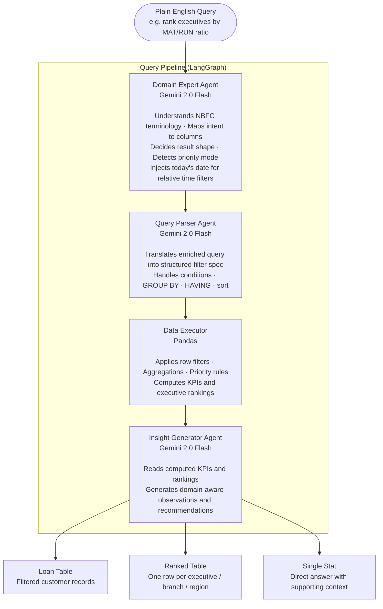
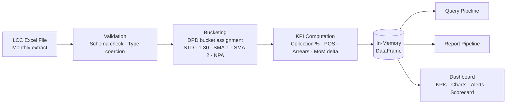

# CollectionIQ

### AI-Powered Portfolio Intelligence for NBFC Collection Leaders

&nbsp;

## The Problem

In a large NBFC, a Regional Business Head or Zonal Head manages thousands of loan accounts across dozens of branches and field executives. Every morning, the same questions come up:

> *"Which accounts should my team prioritize today?"*
> *"Which executive is underperforming and why?"*
> *"How many accounts from last year's advances have gone delinquent?"*
> *"Show me customers who haven't paid in 3 months in the Western region."*

Getting answers to these questions meant raising a request to an analyst, waiting for a report, then asking a follow-up. The cycle repeated for every business question, every day.

Leaders were dependent on coordinators and analysts for information that should have been at their fingertips.

&nbsp;

## What CollectionIQ Does

CollectionIQ is a self-serve portfolio intelligence dashboard built for collection leaders. Upload your monthly LCC Excel extract and the entire portfolio becomes queryable, visual, and explainable - without writing a single formula or waiting for a report.

It answers questions in plain English, surfaces risks automatically, and generates board-ready analysis on demand.

&nbsp;

## Who It Is Built For

| Role | How They Use It |
|---|---|
| Regional Business Head | Monitor region-wide collection efficiency, bucket migration, and executive rankings |
| Zonal Head | Compare branch performance, identify concentration risk, track NPA formation |
| Business Unit Head | Query specific customer segments, get prioritized action lists, analyse new advances |

&nbsp;

## Core Capabilities

**Plain English Query Engine**

Ask questions the way you think them. The system understands NBFC domain language - "show me MAT accounts with no collection in last 1 year", "rank executives by mature to running ratio", "how many advances from last 6 months are already in SMA-2" - and returns the right result, whether that is a filtered customer table, a ranked executive comparison, or a single summary answer.

**Automated Priority Action List**

A seven-tier business priority framework identifies accounts that need immediate attention - non-starters, easy settlements, recent advances already delinquent, insurance-driven arrears, co-lending at risk, long-term non-payers, and NPA accounts. Leaders get a ready-to-act list sorted by business impact, not just EMI count.

**Field Executive Performance Scorecard**

Every field executive is ranked by collection efficiency, strike rate, and NPA percentage. Top performers and underperformers are identified dynamically using quartile analysis so rankings are always relative to the current portfolio, not fixed benchmarks.

**Bucket Migration Analysis**

When two months of data are uploaded, the system shows exactly how accounts moved between DPD buckets - how many cured, how many worsened, and the NPA formation rate. This is the early warning signal that tells a leader whether the portfolio is improving or deteriorating before the numbers become a crisis.

Roll forward and roll backward queries are also supported through the plain English engine. Ask "show me accounts that worsened this month" or "which accounts cured from SMA-1" and get the filtered list instantly.

**Smart Risk Alerts**

Automatic alerts fire when delinquency exceeds thresholds, NACH inactive accounts spike, co-lending loans show arrears, or strike coverage drops. Each alert includes account count, outstanding exposure, and a recommended action.

**Monthly Portfolio Intelligence Report**

A board-ready HTML report with AI-written executive narrative, branch performance league tables, executive rankings, risk flags, and a five-point prioritized action plan. Download it or send it by email directly from the dashboard.

&nbsp;

## The Impact

Before CollectionIQ, a leader needed to raise a request, wait for an analyst to pull data, and then ask a follow-up for any change in filter or angle. Each loop took hours to a day.

With CollectionIQ, the same question is answered in under 30 seconds — directly by the leader, without involving anyone else.

**What this eliminates:**

* Dependency on analysts and coordinators for portfolio queries
* Manual Excel work for bucket-level or executive-level breakdowns
* Delays in identifying which accounts to target for collection
* Subjective prioritization replaced by a structured, data-driven action framework
* Waiting for month-end reports to understand portfolio health

**What this enables:**

* Leaders making faster, evidence-based collection decisions
* Field executives held accountable through transparent scorecards
* Early detection of portfolio stress through bucket migration tracking
* Consistent prioritization logic applied across all regions and branches

&nbsp;

## Architecture

CollectionIQ runs two independent AI pipelines orchestrated with LangGraph — one for answering queries in real time, one for generating the monthly portfolio report.

&nbsp;

### Query Pipeline

Every question typed in plain English passes through four agents in sequence before a result appears on screen.

&nbsp;

### Report Pipeline

Triggered on demand. Runs fully autonomously, no user input needed after clicking Generate.

&nbsp;

### Data Layer

Both pipelines operate on the same in-memory DataFrame loaded from the Excel upload. No database, no cloud storage. Data never leaves the machine.

&nbsp;

## Technology

| Layer | Technology | Role |
|---|---|---|
| UI and Dashboard | Streamlit | Interactive web interface, session state, file upload |
| AI Models | Google Gemini 2.0 Flash | All four AI agents across both pipelines |
| Agent Orchestration | LangGraph | Stateful multi-agent graph with conditional routing |
| Data Processing | Pandas | Filtering, aggregation, bucketing, KPI computation |
| Charts | Plotly | DPD distribution, bucket migration heatmap, branch charts |
| AI SDK | google-genai | Gemini API with retry and exponential backoff |
| Report Delivery | Python smtplib | SMTP email with HTML body and attachment |
| Date Handling | python-dateutil | Relative date resolution for time-based queries |

The domain knowledge layer (NBFC terminology, loan status values, priority framework) is embedded in the agent system prompts. This means the AI understands the difference between a RUN account, a MAT account, and an S&S account without any fine-tuning — the business context is injected at query time, making it straightforward to extend with new domain rules.

Both pipelines are stateless between runs. Each query or report generation starts fresh, which means there is no stale context, no memory leak, and no shared state between users.

&nbsp;

