# CollectionIQ

### AI-Powered Portfolio Intelligence for NBFC Collection Leaders


&nbsp;

## The Problem

In a large NBFC, a Regional Business Head or Zonal Head manages thousands of loan accounts across dozens of branches and field executives. Every morning, the same questions come up:

> *"Which accounts should my team prioritize today?"*
> *"Which executive is underperforming and why?"*
> *"How many accounts from last year's advances have gone delinquent?"*
> *"Show me customers who haven't paid in 3 months in the Western region."*

Getting answers meant raising a request to an analyst, waiting for a report, and then asking a follow-up. The cycle repeated for every business question, every day.

Leaders were dependent on coordinators and analysts for information that should have been at their fingertips.
&nbsp;

## What CollectionIQ Does

CollectionIQ is a self-serve portfolio intelligence platform built for collection leaders. Upload your monthly LCC Excel extract and the entire portfolio becomes queryable, visual, and explainable, without writing a single formula or waiting for a report.

It answers questions in plain English, surfaces risks automatically, and generates board-ready analysis on demand.
&nbsp;


**Live Link : [collectioniq.streamlit.app](https://collectioniq.streamlit.app/)**
&nbsp;


## Try It in 30 Seconds

No data? No setup? Click **Fill Sample Data** on the landing page. It loads a demo portfolio of 8,000 loans across 10 regions (August 2026, with July 2026 as the previous month) and builds the full dashboard instantly. No file upload, no API key, no configuration needed.

The demo data is fully synthetic: no real customer, loan or branch figure. Its patterns (bucket mix, ticket sizes, collection rates, fleet share) were calibrated against a real portfolio in aggregate only, and each region carries a deliberate story so every tab has something to find:

| Region | Story |
|---|---|
| Solapur | Chronic non-payers, highest NPA |
| Nashik | Worsening month on month, one weak branch |
| Sangli | Deep arrears, still paying (older loans sliding into the hard bucket) |
| Kolhapur | Insurance-driven delinquency (EMIs paid, insurance unpaid) |
| Jalgaon | Fleet-operator concentration |
| Nanded | New loans going bad fast, non-starters |
| Satara | Improving, with catch-up collections |
| Thane | Co-lending at risk, easy settlements |
| Pune | Healthiest region; a star and a weak executive in the same branch |
| Ratnagiri | Healthy and stable |

To try the Root Cause tab's due-date-missed check, upload `sample_data/Demo_Due_Date_Missed_List.xlsx` there. Regenerate everything with `python generate_demo_data.py`.
&nbsp;

## Screenshots

**Landing Page: Upload regional files or load sample data instantly**

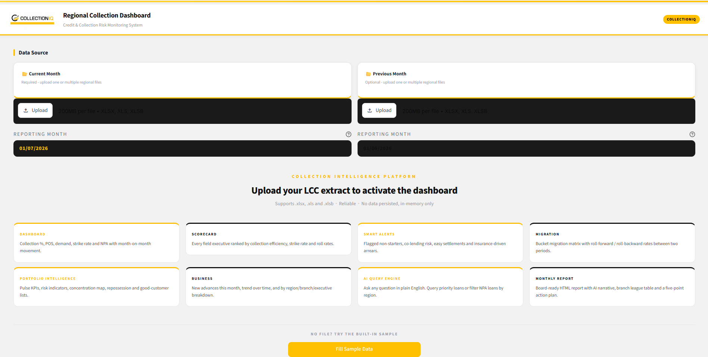
&nbsp;

**Dashboard: a one-page summary of the portfolio: KPIs vs last month, what changed and where, early warning, league tables, new business, alerts and what to do first, each linking to its detail tab**

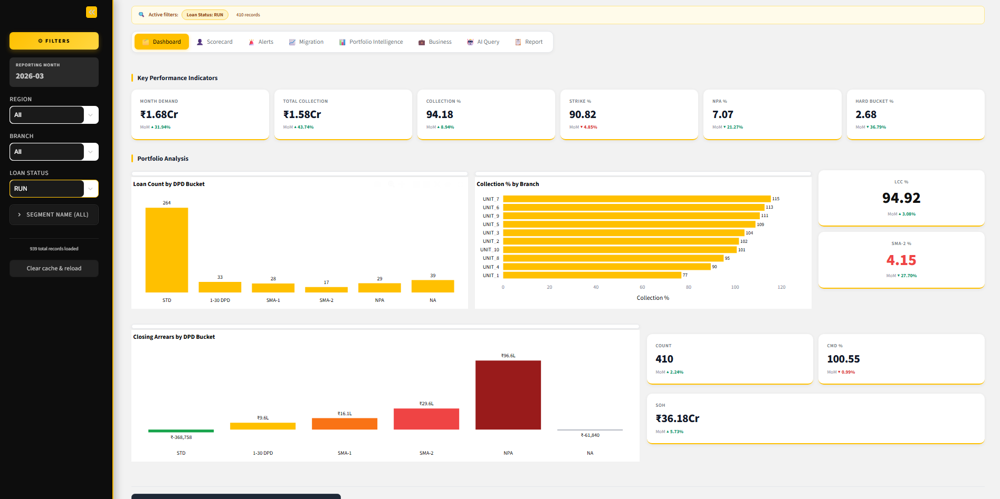
&nbsp;

**Action Lists: every loan-level list in one place (call this week, slipped this month, risk flags, repossession and good customers), each once, with what to do, SOH, change vs last month and a full-column download**
&nbsp;

**Bucket Migration: a one-line summary, who slipped this month (new defaulters, 1-30 → SMA-1 and onward) by loans and by SOH, where it's happening, and the bucket-to-bucket matrix**

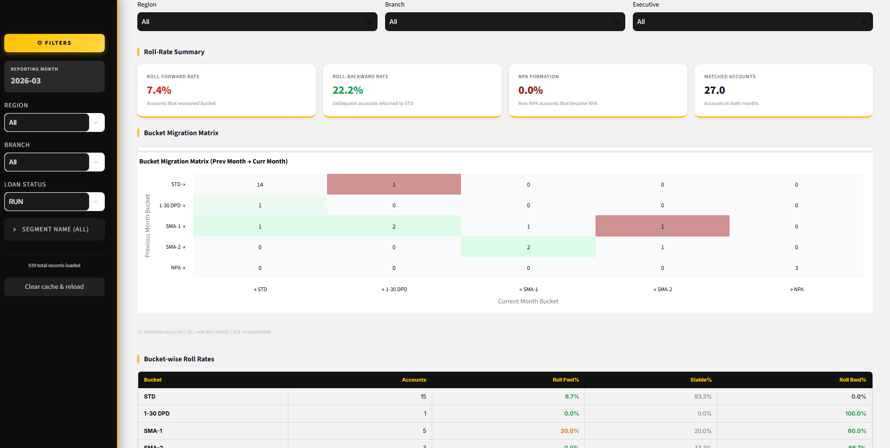
&nbsp;

**Portfolio Intelligence: one question at a time: Regions & Branches, Executives (Top 25% / Middle / Bottom 25% tiers by collection or strike rate), Segments (segment, fuel type, payment mode, NACH, legal stage, secured / unsecured, each by branch or executive too), and Exposure (large customers over ₹2 Cr with their delinquent loans, largest delinquent loans, fleet operators, concentration map)**
&nbsp;

**Root Cause: why it's moving, in four views: the dominant driver per region, insurance vs installment arrears, paying vs not paying, and the recent-advances cohort (with today's due-date-missed list)**
&nbsp;

**Business: new advances this month, by region / branch / executive against last month, the trend, and disbursement vintage**

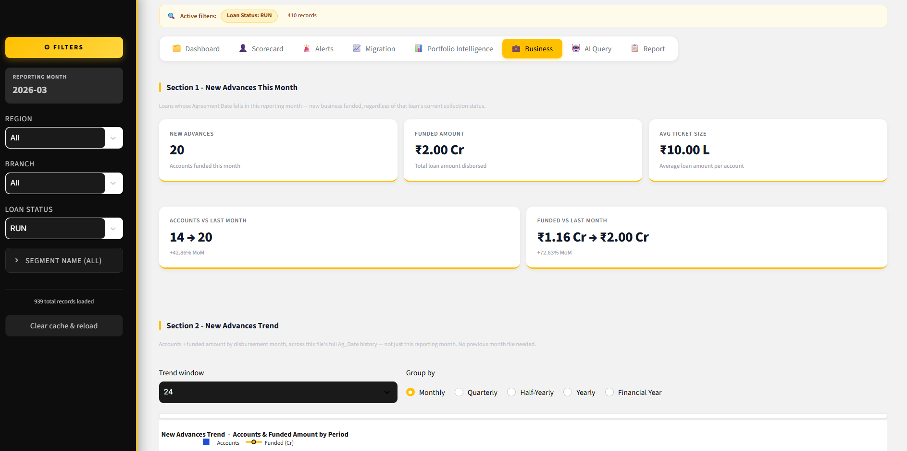
&nbsp;

<table>
<tr>
<td width="50%">

**New Advances Trend: accounts & funded amount by period**

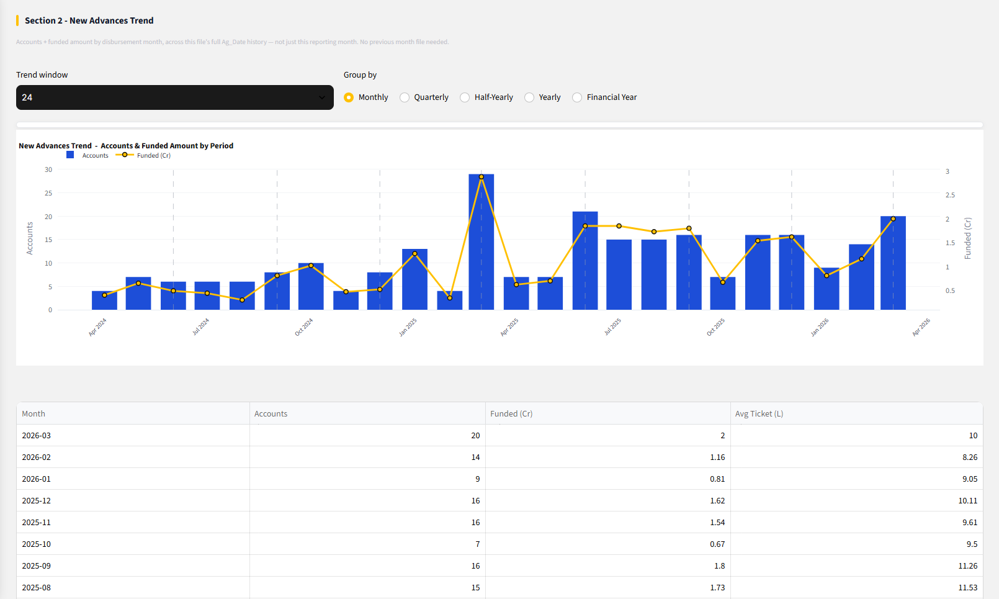

</td>
<td width="50%">

**New Advances by Region/Branch/Executive**

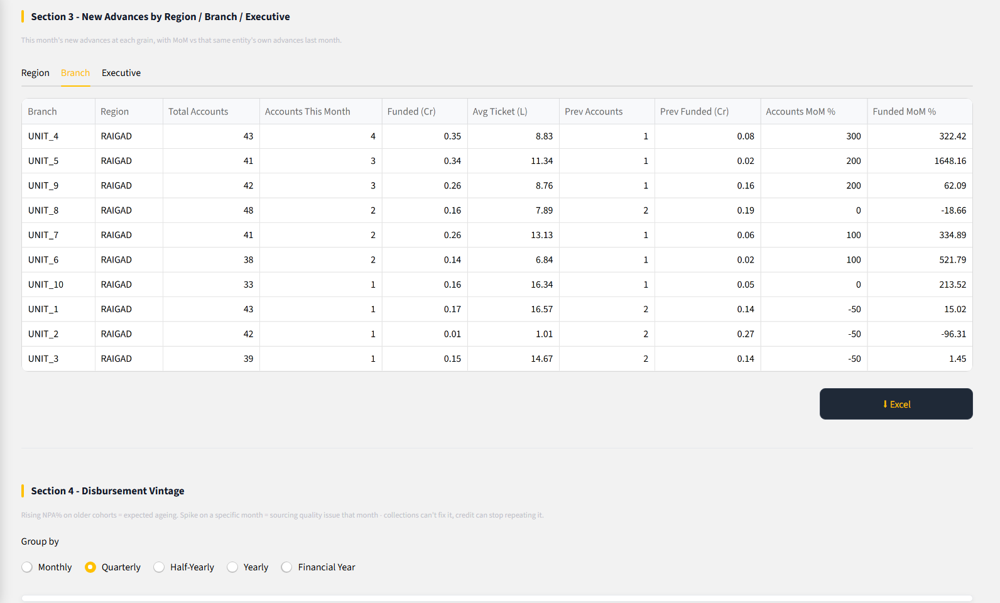

</td>
</tr>
</table>

**Disbursement Vintage: NPA%/SMA-2% by disbursement cohort**

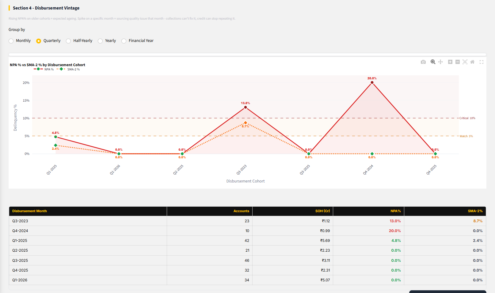
&nbsp;

**AI Query (any list or count in plain English, every pipeline step shown) and the Investigator ("why did this move" drill-downs), powered by Gemini 2.5 Flash-Lite + LangGraph**

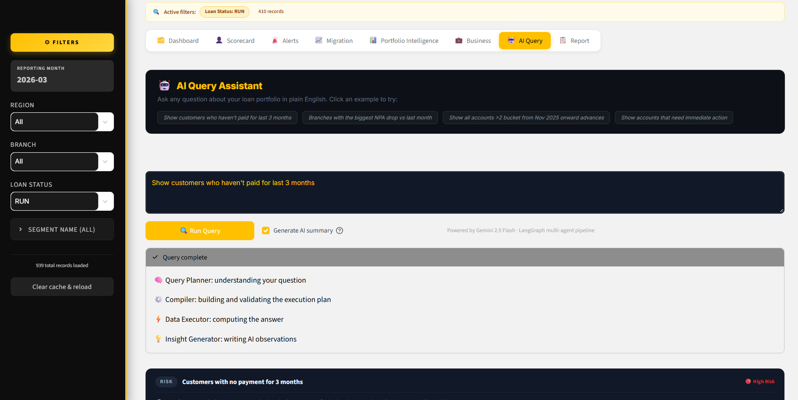
&nbsp;

<table>
<tr>
<td width="50%">

**KPI summary + region/branch/executive breakdown for the matched accounts**

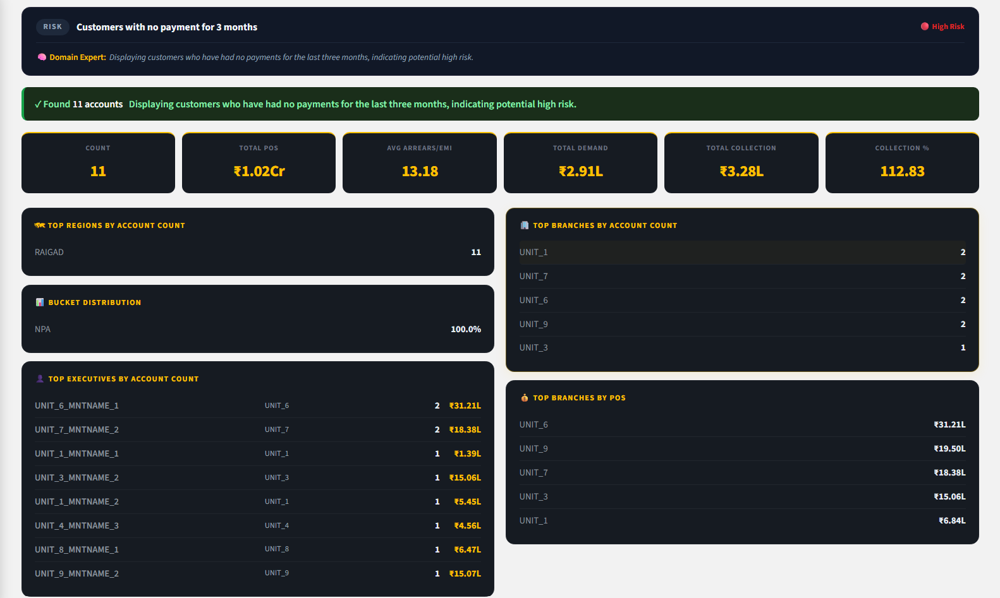

</td>
<td width="50%">

**Matching accounts table + AI-generated observations**

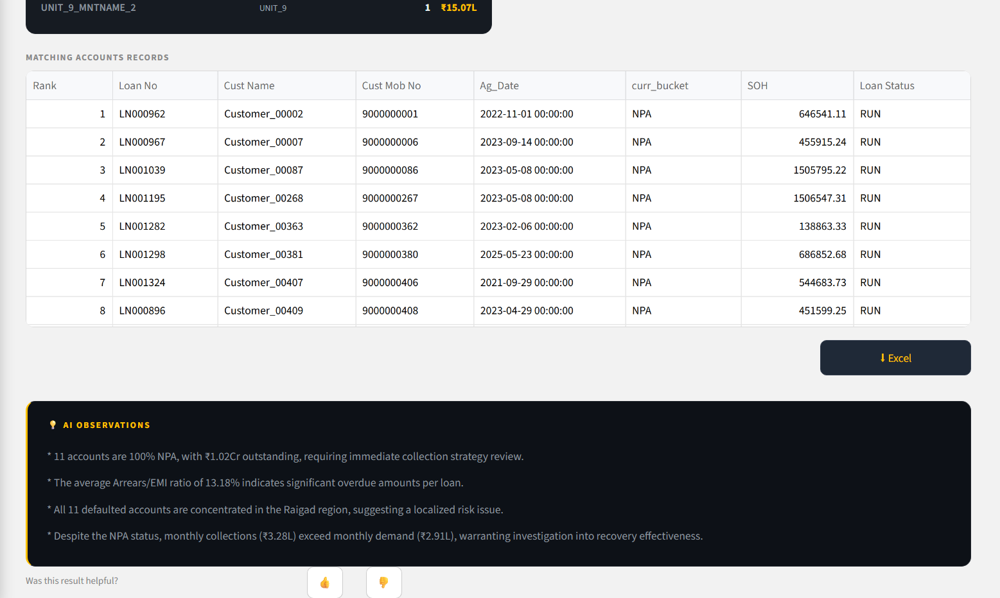

</td>
</tr>
</table>
&nbsp;

**Monthly Report: Regional / Leadership / Branch versions as HTML, PDF and an Excel annex**

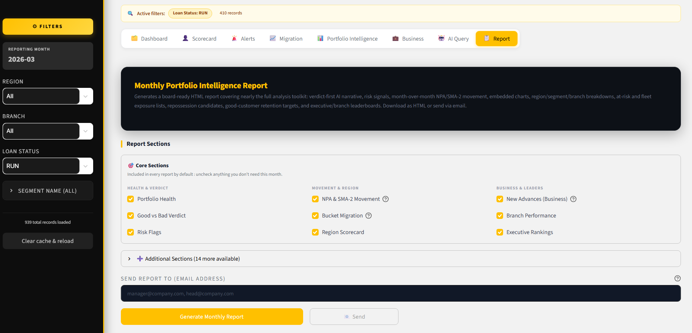
&nbsp;


## Who It Is Built For

| Role | How They Use It |
|---|---|
| Regional Business Head | Monitor region-wide collection efficiency, bucket migration, and executive rankings |
| Zonal Head | Compare branch performance, identify concentration risk, track NPA formation |
| Business Unit Head | Query specific customer segments, get prioritized action lists, analyse new advances |
&nbsp;
## Core Capabilities

**Plain English Query Engine** : Ask any question in NBFC language. Get back a filtered loan table, a ranked executive comparison, or a single stat answer. Multi-step questions (for example "customers per branch with more than 3 loans" or "fleet owners who have not paid this month") are answered by a composable step-plan engine that chains group-by, conditional counts, derive, sort and limit to any depth. When a question is genuinely ambiguous, the agent asks a short clarifying question with 3 to 5 options instead of guessing. Every result includes an Excel download and optional AI observations. Ask for "all columns" to see every raw column plus the computed ones; loan-level downloads always carry them, even when the screen shows a curated subset.

**AI Query and Investigator (two tabs)** : **AI Query** answers any **list, filter, count or custom grouping** ("loans above 2 EMI agreed since November 2025", "NPA count by segment and fuel type") with the pipeline below, showing each step live (understood, planned, validated, compiled, ran) and keeping them under the answer, with a table and KPI cards. The **Investigator** answers **"why"** questions, with a "How I got this" panel on each answer; a list question asked there is handed to AI Query with one click. Ask why collection % is down and drill one level at a time, Business Unit → Zone → Region → Branch → Executive → the actual loans, with customer names attached. It checks the mechanism behind a move (roll rate, vintage, overdue vs current demand), offers a 9-category priority menu, and drafts a branch email as a downloadable .eml that is never sent automatically. The AI only picks which tested calculation to run; nothing runs without a click, and multi-customer results reach Gemini only as counts and totals, never customer names.

**Multi-Region File Support** : Upload multiple regional LCC files at once for a unified view. Supports `.xlsx`, `.xls`, and `.xlsb` with automatic deduplication and datetime normalisation across files.

**Robust Column Normalisation** : A four-pass pipeline handles truncated headers, trailing spaces, and capitalisation differences. Verified at 100% accuracy across all 85 expected columns. Multi-sheet workbooks auto-detect the LCC sheet.

**Automated Priority Action List** : Seven-tier business priority framework ranks accounts by impact. Non-starters, easy settlements, insurance arrears, co-lending risk, and NPA accounts each get their own actionable tier.

**Executive Tiers** : In Portfolio Intelligence → Executives, every executive is placed in the top 25%, middle or bottom 25% of the executives listed, by collection % (or by strike rate when sorted by it, to see who's current on this month's instalment, not just who collected the most). The bottom quarter is marked red.

**Sidebar Filters** : Zone, Region, Branch, Loan Status, loan date (on or after) and Segment apply to every tab and the report. Zone narrows the Region list and Region narrows Branch, so the choices always fit together. Every "by level" view follows the same hierarchy, Zone → Region → Branch → Executive: Portfolio Intelligence, the Dashboard league table, Migration's drill-down and roll tables, Business, overdue vs demand, and Root Cause's recent-advance tables. Zone appears wherever the file has a Zone column.

**Dashboard Summary** : The first tab reads like a monthly review: KPIs against last month, the regions and branches that moved most, early-warning slips with a next-month forecast, a league table for any metric (worst or best, with last month's rank), new business, alert counts, and a "what to do first" summary whose lists open in Action Lists. Every section links to its detail tab.

**Roll Analysis by Count and SOH** : Two months of data show which loans moved between DPD buckets, measured both by number of loans and by last month's SOH, so a few large loans slipping are never hidden. The early steps get the most attention: new defaulters (STD last month, behind now) and 1-30 DPD loans slipping to SMA-1, by region, branch and executive; the loans behind each step are lists in Action Lists.

**6 Smart Risk Alerts** : Pure pandas, no LLM, always accurate. Their loans are in Action Lists ("Risk flags"); Non Starters and Insurance-Driven Delinquency are the same loans as two "Call this week" lists, so they appear once, there:

| Alert | Severity | What It Catches |
|---|---|---|
| Non Starters | Critical | Never paid 1st EMI |
| Co-lending at Risk | Critical | Partner bank exposure showing delinquency |
| High Arrears: Loan at Risk | Critical | Inst+Exp+BC arrears exceed 50% of original loan |
| Insurance-Driven Delinquency | High | EMI paid but insurance charge causing false delinquency |
| Recent Advances at Risk | High | Loans under 12 months already delinquent |
| Easy Settlements | Medium | Closing arrears under ₹1,000 |

**SOH as the True Exposure Metric** : Uses Sum of Hire (POS + Closing Arrears) instead of POS alone. For MAT and S&S accounts where POS = 0, SOH correctly reflects what is actually owed.

**Monthly Report** : Built for the people it goes to: **Regional** (default, for regional managers), **Leadership** (2 to 3 pages) and **Branch** (one branch's executives and call lists). It opens with plain-sentence findings worked out from the data by fixed rules, then the scoreboard, early warning and forecast, league tables, needs attention, why it's happening, alerts and priorities. Every section is a checkbox: picking Regional, Leadership or Branch ticks that report's sections, and any of them can be unticked or ticked; nine optional detail sections (repossession, fleet, good customers, segments, overdue vs demand and more) can be added, with Select all / Clear all. One report model is rendered as **email-safe HTML, PDF and an Excel annex** (every table in full plus every call list), so the three never disagree. **Branch packs** zip one PDF and annex per branch for a regional manager to send on. An optional AI paragraph (off by default) only rewrites the findings; any number it writes that isn't in the data gets it dropped.
&nbsp;


## The Impact

Before CollectionIQ, every portfolio question meant raising a request, waiting for an analyst, and asking a follow-up. Each loop took hours to a day.

With CollectionIQ, the same question is answered in under 30 seconds by the leader directly.

| Before | After |
|---|---|
| Analyst dependency for every query | Self-serve in plain English |
| Manual Excel work for breakdowns | Instant filtered results with AI observations |
| Subjective account prioritisation | Seven-tier data-driven priority framework |
| Month-end reports for portfolio health | Real-time bucket migration and alerts on every upload |
| Every click on a 60k-row portfolio felt like a fresh page load (~26s) | Same interaction now returns in well under a second, measured on real data |
&nbsp;

## Architecture

CollectionIQ answers questions in two tabs: AI Query, backed by the pipeline below (orchestrated with LangGraph), and the Investigator's drill-down steps. Everything else (dashboard, alerts, roll analysis, the monthly report) is deterministic pandas over one shared set of metric definitions, so a number is the same in every tab and every report.
&nbsp;

### AI Query Pipeline

Every question typed in plain English flows through a LangGraph state machine built on a "plan, then compile" design. A Logical Planner agent never writes execution logic itself, it emits a declarative intent (which filters, which metrics, which dimensions) chosen from a fixed registry vocabulary, and a deterministic pandas compiler turns that into an executable step-plan.

Four routes leave the Planner, not two: a clear query goes through the fast-path view lookup or the compiler, a priority-action query (*"what should my team work today"*) skips both and runs straight against the seven-tier priority framework, and a materially ambiguous query gets a clarifying question instead of a guess. That clarifying question is not a loop inside the graph, it is a hard stop: the graph run ends, the UI shows the options, and picking one starts a brand-new run with the chosen interpretation folded into the question text.

<sup>🟠 Gemini call &nbsp;·&nbsp; 🟢 deterministic pandas, no LLM &nbsp;·&nbsp; ⚪ routing / terminal</sup>

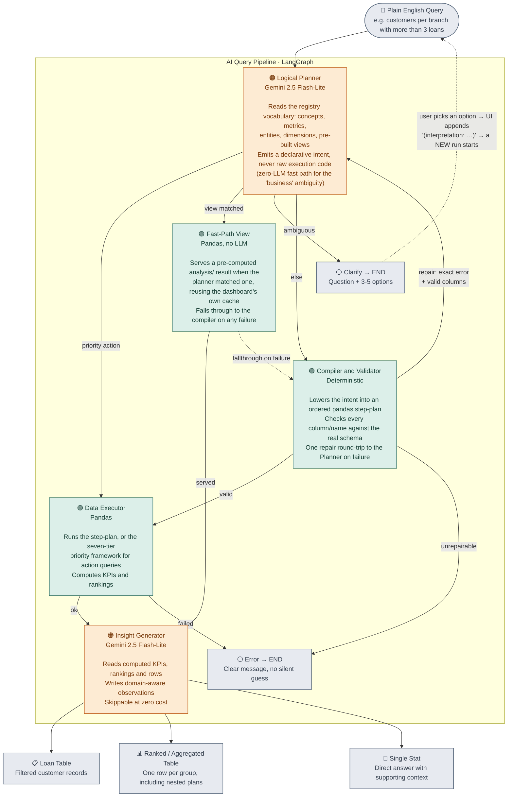
```mermaid
flowchart TD
    User(["🧑 Plain English Query\ne.g. customers per branch with more than 3 loans"]) --> LP

    subgraph QP ["  AI Query Pipeline · LangGraph  "]
        direction TB
        LP["🟠 Logical Planner\nGemini 2.5 Flash-Lite\n\nReads the registry vocabulary: concepts, metrics,\nentities, dimensions, pre-built views\nEmits a declarative intent, never raw execution code\n(zero-LLM fast path for the 'business' ambiguity)"]
        VW["🟢 Fast-Path View\nPandas, no LLM\n\nServes a pre-computed analysis/ result when the\nplanner matched one, reusing the dashboard's own cache\nFalls through to the compiler on any failure"]
        CV["🟢 Compiler and Validator\nDeterministic\n\nLowers the intent into an ordered pandas step-plan\nChecks every column/name against the real schema\nOne repair round-trip to the Planner on failure"]
        EX["🟢 Data Executor\nPandas\n\nRuns the step-plan, or the seven-tier\npriority framework for action queries\nComputes KPIs and rankings"]
        IG["🟠 Insight Generator\nGemini 2.5 Flash-Lite\n\nReads computed KPIs, rankings and rows\nWrites domain-aware observations\nSkippable at zero cost"]
        CL["⚪ Clarify → END\nQuestion + 3-5 options"]
        ERR["⚪ Error → END\nClear message, no silent guess"]

        LP -->|priority action| EX
        LP -->|view matched| VW
        LP -->|ambiguous| CL
        LP -->|else| CV
        VW -->|served| IG
        VW -.fallthrough on failure.-> CV
        CV -->|"repair: exact error\n+ valid columns"| LP
        CV -->|valid| EX
        CV -->|unrepairable| ERR
        EX -->|ok| IG
        EX -->|failed| ERR
    end

    CL -.->|"user picks an option → UI appends\n'(interpretation: …)' → a NEW run starts"| User
    IG --> R1["📋 Loan Table\nFiltered customer records"]
    IG --> R2["📊 Ranked / Aggregated Table\nOne row per group, including nested plans"]
    IG --> R3["🔢 Single Stat\nDirect answer with supporting context"]

    classDef llm fill:#FDEBD3,stroke:#C1611D,color:#7A3D0F,stroke-width:1.4px;
    classDef det fill:#DCEFE9,stroke:#2F6F5E,color:#1C4238,stroke-width:1.4px;
    classDef neutral fill:#E7EAF0,stroke:#5B6B7F,color:#37414F,stroke-width:1.4px;
    class LP,IG llm;
    class VW,CV,EX det;
    class User,CL,ERR,R1,R2,R3 neutral;
```

The step-plan engine (`agents/plan_executor.py`) exists because a single GROUP BY counts rows per group and cannot express nested analytics. A plan is an ordered list of steps (group_aggregate with an optional conditional `where`, filter, derive, sort, limit); each step transforms the previous step's table, so arbitrary depth composes without special-casing. Only whitelisted operations run, never arbitrary code, and every `derive` expression is checked against a disallowed-pattern list before it reaches pandas.

The vocabulary the Logical Planner picks from lives in `registry/`: `ontology.py` defines named filter concepts (for example easy settlement, co-lending at risk) and named metrics (including registered percentage metrics like strike rate and hard bucket percentage), `semantic_model.py` defines the grain entities (loan, customer, executive, branch, region) and group-by dimensions, and `views.py` defines the pre-built fast-path views (executive scorecard, roll-rate matrix, top delinquent accounts, and more) that let a common question skip the general compiler entirely and return an answer that is numerically identical to what the dashboard tabs already show.

&nbsp;
### Report

Triggered on demand; no AI is needed. The report is first built as a **model** (an ordered list of headings, findings, KPI rows and tables) from the same engines the dashboard uses, then rendered three ways, so HTML, PDF and Excel always say the same thing.

<sup>🟠 optional Gemini call &nbsp;·&nbsp; 🟢 deterministic, no LLM &nbsp;·&nbsp; ⚪ entry / delivery</sup>

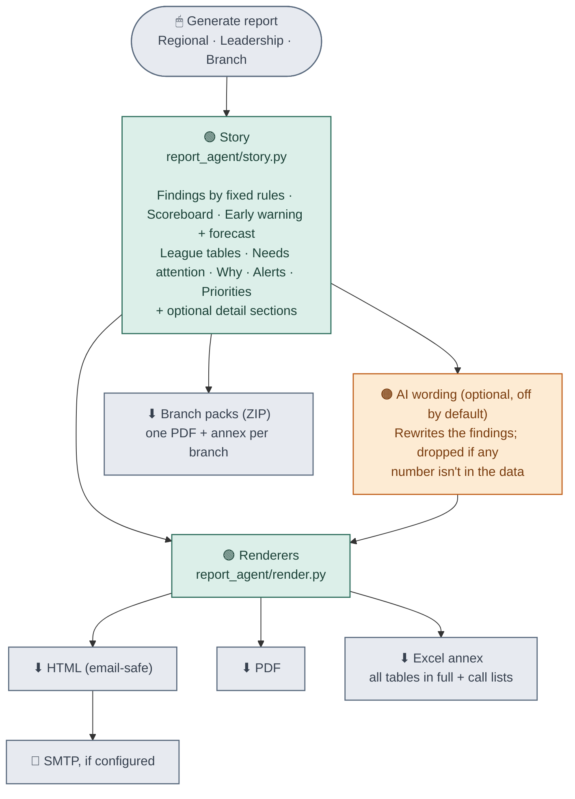
```mermaid
flowchart TD
    Trigger(["🖱 Generate report
Regional · Leadership · Branch"]) --> ST
    ST["🟢 Story
report_agent/story.py

Findings by fixed rules · Scoreboard · Early warning + forecast
League tables · Needs attention · Why · Alerts · Priorities
+ optional detail sections"]
    ST --> AI["🟠 AI wording (optional, off by default)
Rewrites the findings; dropped if any
number isn't in the data"]
    ST --> R["🟢 Renderers
report_agent/render.py"]
    AI --> R
    R --> H["⬇ HTML (email-safe)"]
    R --> P["⬇ PDF"]
    R --> X["⬇ Excel annex
all tables in full + call lists"]
    H --> EM["📧 SMTP, if configured"]
    ST --> PK["⬇ Branch packs (ZIP)
one PDF + annex per branch"]

    classDef llm fill:#FDEBD3,stroke:#C1611D,color:#7A3D0F,stroke-width:1.4px;
    classDef det fill:#DCEFE9,stroke:#2F6F5E,color:#1C4238,stroke-width:1.4px;
    classDef neutral fill:#E7EAF0,stroke:#5B6B7F,color:#37414F,stroke-width:1.4px;
    class AI llm;
    class ST,R det;
    class Trigger,H,P,X,EM,PK neutral;
```

&nbsp;
### Data Layer

The query pipeline, the dashboard and the report all operate on the same in-memory DataFrame loaded from the Excel upload. No database, no cloud storage. Data never leaves the machine. Because the dashboard, the query pipeline, and the report all read this one cached DataFrame through the same `analysis/` functions, a number shown in one place is the same number shown everywhere else.

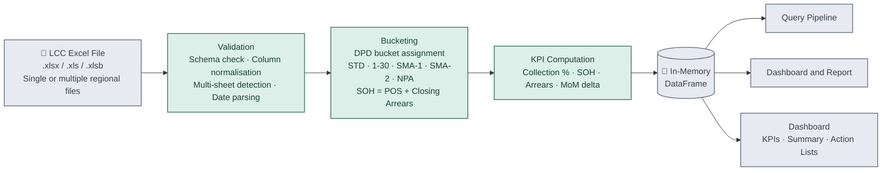
```mermaid
flowchart LR
    XL["📄 LCC Excel File\n.xlsx / .xls / .xlsb\nSingle or multiple regional files"] --> VAL["Validation\nSchema check · Column normalisation\nMulti-sheet detection · Date parsing"]
    VAL --> BK["Bucketing\nDPD bucket assignment\nSTD · 1-30 · SMA-1 · SMA-2 · NPA\nSOH = POS + Closing Arrears"]
    BK --> KPI["KPI Computation\nCollection % · SOH · Arrears · MoM delta"]
    KPI --> DF[("💾 In-Memory\nDataFrame")]
    DF --> QP2["Query Pipeline"]
    DF --> RP2["Dashboard and Report"]
    DF --> DB["Dashboard\nKPIs · Summary · Action Lists"]

    classDef det fill:#DCEFE9,stroke:#2F6F5E,color:#1C4238,stroke-width:1.4px;
    classDef neutral fill:#E7EAF0,stroke:#5B6B7F,color:#37414F,stroke-width:1.4px;
    class VAL,BK,KPI det;
    class XL,DF,QP2,RP2,DB neutral;
```

&nbsp;
## Project Structure

```
CollectionIQ/
├── app.py                          # Main Streamlit app, all UI layout and state
├── graph.py                        # AI query pipeline (LangGraph state machine)
├── utils.py                        # Data loading, column normalisation, metrics, charts
├── smart_alerts.py                 # 6 rule-based risk alerts (pure pandas, no LLM)
├── config.py                       # Model name, thresholds, and other tuned constants
├── gemini_client.py                # Shared Gemini client: timeout + transient-only retry
├── generate_demo_data.py           # Builds the synthetic demo files in sample_data/
│
├── agents/
│   ├── logical_planner.py          # Query to declarative intent (IR-1), the live planner
│   ├── data_executor.py            # Priority framework, KPI/ranking computation
│   ├── plan_executor.py            # Composable step-plan engine + plan validator
│   └── insight_generator.py        # AI observations on query results
│
├── investigator/
│   ├── llm.py                      # Routes each chat turn to one step (Gemini) + optional narration
│   ├── guardrails.py               # Deterministic checks on the routed step before it runs
│   ├── steps.py                    # Step vocabulary: every calculation the Investigator can run
│   └── state.py                    # Per-conversation memory so "him" / "that branch" resolve
│
├── compiler/
│   ├── core.py                     # Lowers a declarative intent into a pandas step-plan
│   └── measures.py                 # Measure kinds: additive, ratio, count_ratio, and more
│
├── registry/
│   ├── ontology.py                 # Named filter concepts, named metrics, priority rules
│   ├── semantic_model.py           # Grain entities and group-by dimension aliases
│   └── views.py                    # Fast-path pre-built view catalog
│
├── analysis/
│   ├── portfolio_intelligence.py   # Region/branch/executive tables, segments, risk signals, overdue vs demand
│   ├── new_business.py             # New advances, their trend, disbursement vintage
│   ├── exposure.py                 # Large customers, fleet operators, top accounts, concentration,
│   │                               #   repossession candidates, good customers
│   ├── executive_scorecard.py      # Per-executive KPIs with quartile tier ranking
│   ├── roll_rate.py                # Bucket migration matrix and roll-rate KPIs
│   ├── roll_flow.py                # Roll steps by count and SOH, by region/branch/executive
│   ├── root_cause.py               # Why delinquency moves: insurance split, paying vs not
│   ├── action_center.py            # Findings, focus list, forecast, needs attention, call lists
│   ├── action_lists.py             # Every loan-level list for the Action Lists tab, each once
│   └── summary.py                  # Dashboard summary: moves, league tables, business, alerts
│
├── ui/
│   ├── tabs/                       # One module per dashboard tab (ai_query.py, investigator.py, ...)
│   ├── query_answer.py             # Runs AI Query questions (steps shown live) and draws their answers
│   ├── action_overview.py          # The Dashboard summary sections
│   ├── components.py               # Shared KPI cards, download buttons, shading, safe tables
│   ├── glossary.py                 # Plain-language definitions behind every ⓘ
│   └── landing.py                  # Upload page and sample-data loader
│
├── report_agent/
│   ├── story.py                    # The report model: presets and optional sections
│   ├── render.py                   # Model -> HTML, PDF (reportlab) and Excel annex
│   ├── packs.py                    # Branch packs: one report per branch, zipped
│   ├── ai_summary.py               # Optional AI wording with a numbers check
│   └── nodes/
│       └── email_dispatcher.py     # SMTP delivery
│
├── sample_data/
│   ├── Current_Month_Demo.xlsx     # Synthetic demo LCC, Aug 2026 (8,000 loans)
│   ├── Previous_Month_Demo.xlsx    # Synthetic demo LCC, Jul 2026
│   └── Demo_Due_Date_Missed_List.xlsx  # Demo list for the Root Cause due-date check
│
└── requirements.txt
```

&nbsp;
## Technology

| Layer | Technology | Role |
|---|---|---|
| UI and Dashboard | Streamlit | Interactive web interface, session state, multi-file upload |
| AI Models | Google Gemini 2.5 Flash-Lite | The query pipeline, the Investigator, and the optional report wording |
| Agent Orchestration | LangGraph | Stateful multi-agent graph with conditional routing, fast-path views, and clarification |
| Data Processing | Pandas | Filtering, aggregation, bucketing, KPI computation |
| Charts | Plotly | Interactive charts in the app |
| Report Formats | reportlab · openpyxl | The monthly report as PDF, and its Excel annex |
| AI SDK | google-genai | Gemini API via one shared client: per-request timeout, exponential-backoff retry on transient errors only (rate limits, server/network failures), fail-fast on permanent ones |
| Report Delivery | Python smtplib | SMTP email with the HTML report as body and attachment |
| Observability | LangSmith | Query tracing and result quality feedback |
| Excel Formats | python-calamine · openpyxl · xlrd · pyxlsb | Reads .xlsx, .xls and .xlsb with calamine (about 5x faster), falling back to the per-format reader; serial-date correction |
| Date Handling | python-dateutil | Relative date resolution for time-based queries |

The domain knowledge layer, NBFC terminology, loan status values, strike rate definition, SOH calculation, priority framework, and insurance delinquency logic, is embedded in the agent system prompts and verified against real portfolio data. The AI understands the difference between a RUN account, a MAT account, and an S&S account without any fine-tuning. Business context is injected at query time, making it straightforward to extend with new domain rules.

Correctness is enforced outside the model, not by model depth. The LLM only translates a question into a declarative intent picked from a fixed registry vocabulary; a deterministic compiler turns that into a pandas step-plan, and pure pandas computes every number. A validator checks the plan against the actual columns and gives the planner one repair attempt with the exact error text before giving up with a clear message. When a question is materially ambiguous, the agent asks a clarifying question instead of assuming. The aim is general, composable reasoning rather than a hardcoded answer per question.

The query and report pipelines are stateless between runs: each query or report starts fresh, with no shared state between users. The Investigator deliberately keeps per-conversation memory so follow-ups resolve, capped at a fixed number of results and conversations per browser session and never shared across users.

&nbsp;


